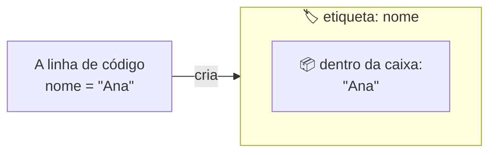
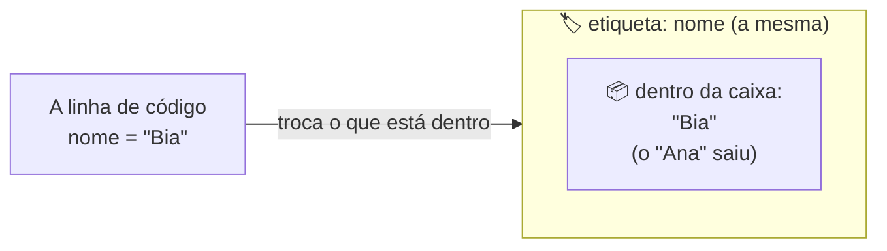

# Ruby, Rails e Git


{: .ilustracao .ilustracao-secao }

Ilustração: [unDraw](https://undraw.co/)
{: .fs-2 .text-center }

Antes de começar o projeto, vale conhecer as três ferramentas principais. Não precisa decorar nada: esta página é só uma visão geral, e o projeto mostra cada uma na prática. Leitura de uns 10 minutos.

## Ruby, a linguagem

O **[Ruby]({{ site.baseurl }}#ruby)** é uma [linguagem de programação]({{ site.baseurl }}#linguagem-de-programacao): um jeito de escrever instruções que o computador entende. Ele foi criado no Japão, em 1995, por Yukihiro Matsumoto, o Matz, com uma ideia que ficou famosa: uma linguagem que ajude quem programa a gostar de programar e a ser feliz.

Por isso, o código Ruby costuma ser fácil de ler, quase como uma frase em inglês:

```ruby
"Rails Girls".upcase      # => "RAILS GIRLS"
3.times { puts "Oi!" }     # escreve "Oi!" três vezes
nome = "Ana"
"Oi, #{nome}!"            # => "Oi, Ana!"
```

- `upcase` deixa um texto em letras maiúsculas.
- `3.times` repete alguma coisa três vezes.
- `nome = "Ana"` guarda um texto numa [variável]({{ site.baseurl }}#variavel), e o `#{nome}` coloca esse texto no meio de outro.
- O que vem depois do `#` é um comentário: uma anotação para quem lê, que o Ruby ignora.

<details class="pergunta" markdown="1">
<summary>O que é uma variável?</summary>

Uma **variável** é um nome que guarda uma informação para usar depois. Pense numa caixa com uma etiqueta. A etiqueta é o nome da variável, e o que está dentro da caixa é a informação. Por exemplo, a linha `nome = "Ana"` cria uma caixa com a etiqueta `nome` e coloca dentro dela o texto `"Ana"`. Daí em diante, sempre que o código usar `nome`, é como se usasse `"Ana"`.



E dá para trocar o que está na caixa: depois de `nome = "Bia"`, o mesmo `"Oi, #{nome}!"` vira `"Oi, Bia!"`.



</details>

## Rails, o framework

O **[Rails]({{ site.baseurl }}#rails)**, ou **Ruby on Rails**, é um [framework]({{ site.baseurl }}#framework) para criar sites e aplicações web com Ruby. Ele foi criado em 2004 por David Heinemeier Hansson e é usado em sites como o GitHub e o Shopify.

Um framework traz pronto o que quase todo app web precisa: receber a [requisição]({{ site.baseurl }}#requisicao) do navegador, guardar informações num banco de dados, montar as páginas. Assim, você se concentra no que é só do seu app.

O Rails também segue [convenções]({{ site.baseurl }}#convencao): combinados sobre que nome dar e onde colocar cada arquivo. Seguindo o combinado, ele liga as peças sozinho, e você escreve muito menos código.

No projeto, você vai conhecer as peças principais de um app Rails, uma por capítulo: a [rota]({{ site.baseurl }}#rota), o [controller]({{ site.baseurl }}#controller), a [view]({{ site.baseurl }}#view), o [model]({{ site.baseurl }}#model) e a [migration]({{ site.baseurl }}#migration). Não precisa entender agora: os nomes vão fazer sentido quando você usar cada uma.

## Git e GitHub, para guardar o seu progresso

O **[Git]({{ site.baseurl }}#git)** guarda versões do seu projeto, como os pontos salvos de um jogo de videogame. Cada versão salva é um **commit**. Se algo der errado, dá para voltar à última versão que funcionava.

O **[GitHub]({{ site.baseurl }}#github)** é um site onde você guarda o seu projeto, com todos os commits, na internet. É parecido com um Google Drive ou um Dropbox, só que para código, com uma diferença: ele não salva sozinho. Você escolhe quando guardar uma versão (o commit) e quando enviar para lá. Assim, você pode continuar de qualquer lugar, e outras pessoas podem ver o seu código.

Em resumo: o Git é a ferramenta, e o GitHub é o lugar. Veja como usar os dois no projeto em [Git básico]({{ site.baseurl }}).

## As palestras do pré-evento

Antes de cada workshop, o Rails Girls São Paulo faz um pré-evento com três palestras para quem vai participar. As gravações ficam no [canal do Rails Girls São Paulo no YouTube](https://www.youtube.com/@RailsGirls-SP), para assistir quando quiser.

<!-- TODO: colocar os links das gravações ou dos slides das palestras do pré-evento de cada edição, com o título e o nome de quem palestrou. -->

## E agora?

Siga para [Terminal básico]({{ site.baseurl }}), ou comece o projeto pelo [Mural de recados]({{ site.baseurl }}).
