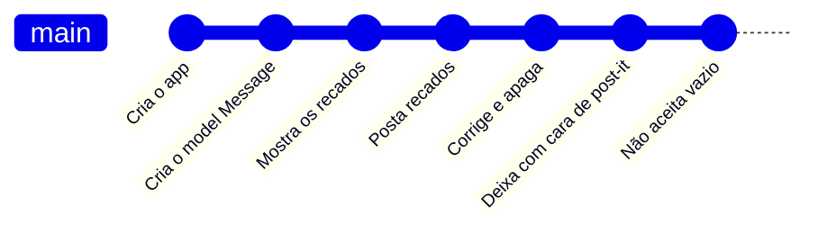
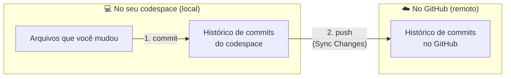
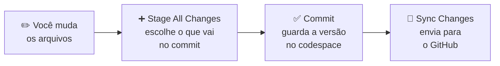
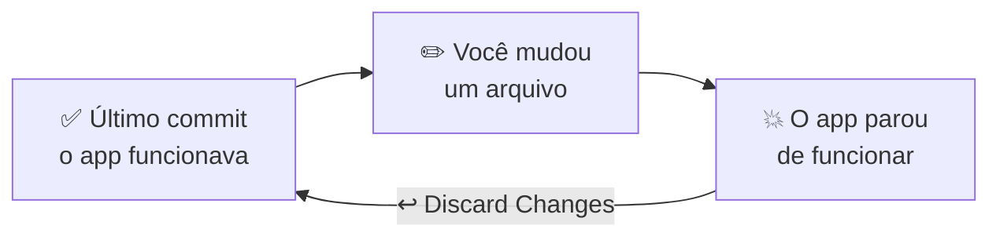

# Git básico

O **[Git]({{ site.baseurl }}#git)** guarda versões do seu projeto. Cada vez que você termina uma parte e quer guardar como ela está, você faz um **[commit]({{ site.baseurl }}#commit)**: uma foto do projeto naquele momento, com uma mensagem dizendo o que mudou.

É como o "salvar" de um jogo de videogame: se algo der errado depois, dá para voltar ao último ponto salvo.

No projeto Mural de recados, cada capítulo termina com um commit. O histórico do seu repositório vai ficar parecido com este, uma bolinha para cada ponto salvo:



Se algo der errado no meio de um capítulo, dá para voltar para a última bolinha, onde tudo funcionava.

## Por que usar?

- **Desfazer.** Se você mudar alguma coisa e o app parar de funcionar, dá para desfazer e voltar à última versão que funcionava.
- **Contar a história do projeto.** Cada commit tem uma mensagem. Juntos, eles mostram o que foi feito e quando.
- **Guardar no GitHub.** O commit fica no seu computador, ou no seu codespace. Quando você envia os commits para o [GitHub]({{ site.baseurl }}#github), o projeto fica guardado lá também, e você pode continuar de qualquer lugar.

## Commit e push: duas etapas

Guardar o progresso tem duas etapas, em dois lugares diferentes:



1. **O commit é local.** Ele guarda uma versão do projeto no histórico do seu codespace. É rápido e não precisa de internet, mas só existe ali: se o codespace for apagado, os commits vão junto.
2. **O push é remoto.** Ele envia os commits do codespace para o seu repositório no GitHub. A partir daí, eles ficam guardados também na internet: dá para ver no site do GitHub, continuar de outro computador e, no capítulo 08, colocar o app no ar.

**Por que duas etapas, e não uma só?** Porque assim você decide quando os seus commits saem do codespace. Dá para fazer vários commits pequenos, mesmo sem internet, conferir e até desfazer algum, e só depois enviar tudo para o GitHub. E, num repositório público, o que você envia fica visível para qualquer pessoa.

Por isso o guia sempre pede as duas coisas no passo **Guarde o seu progresso**: o **Commit** e o **Sync Changes**. Um commit sem push fica guardado só no codespace, e o GitHub não fica sabendo dele.

O **Sync Changes** faz um pouco mais que o push: ele também traz para o codespace os commits que estiverem no GitHub e ainda não estiverem no codespace (isso se chama **pull**). No projeto, só você mexe no seu repositório, então não precisa se preocupar com isso: na prática, ele só envia os seus commits.

## No Codespaces

O Git já vem instalado no codespace e ligado ao seu repositório no GitHub. Você não precisa configurar nada.

No projeto, o guia usa o painel **Source Control** do editor, no ícone de ramificação na barra da esquerda. Lá, você faz tudo com cliques:




1. Clique no **+** ao lado de **Changes** (**Stage All Changes**) para escolher o que vai no commit. No projeto, vai sempre tudo.
2. Escreva a mensagem do commit e clique em **Commit**.
3. Clique em **Sync Changes** para enviar o commit para o GitHub.

{: .pensando }
O ideal é revisar o que mudou, linha por linha, antes de cada commit, e escolher só o que faz parte dele. No painel **Source Control**, dá para clicar em cada arquivo da lista **Changes** e ver as linhas novas e as apagadas. No workshop, para simplificar, a gente usa o **Stage All Changes** e coloca tudo no commit.

Você faz isso pela primeira vez em [Por onde começar?]({{ site.baseurl }}).

<details class="pergunta" markdown="1">
<summary>Os mesmos passos, com comandos <span class="label label-purple">Para ir além</span></summary>

Os cliques do painel **Source Control** rodam comandos do Git por trás. Se quiser, dá para fazer o mesmo no terminal:

| Comando | O que faz | No painel |
|---|---|---|
| `git status` | Mostra o que mudou desde o último commit. | A lista de **Changes** |
| `git add .` | Escolhe todas as mudanças para o próximo commit. | **Stage All Changes** (o **+**) |
| `git commit -m "Mostra os recados no mural"` | Faz o commit, com a mensagem entre aspas. | **Commit** |
| `git push` | Envia os commits para o GitHub. | **Sync Changes** |

O `git status` é o mais útil para usar a qualquer momento: ele não muda nada, só mostra como as coisas estão.

</details>

## Quando fazer um commit

No projeto, **todo capítulo termina com um commit**, num passo chamado **Guarde o seu progresso**. É o momento em que o mural de recados está funcionando, um pouco melhor que antes.

Uma boa mensagem de commit diz o que mudou, começando por um verbo: `Mostra os recados no mural`, `Posta recados pelo formulário`.

## Deu errado? Desfazendo mudanças




Se você mudou um arquivo, o app parou de funcionar e você quer voltar ao último commit:

1. No painel **Source Control**, passe o mouse sobre o arquivo em **Changes**.
2. Clique na seta curva, **Discard Changes** (descartar mudanças), e confirme.

O arquivo volta a ficar como estava no último commit. Pelo terminal, o mesmo comando é `git restore` seguido do nome do arquivo, por exemplo `git restore app/views/messages/index.html.erb`.

{: .atencao }
Descartar apaga as mudanças daquele arquivo desde o último commit, e não tem como recuperar. Antes, confira se é isso mesmo que você quer. Na dúvida, peça ajuda para alguém da mentoria.

Por isso, fazer commits com frequência ajuda: quanto mais recente o último commit, menos trabalho você perde ao voltar.

<details class="pergunta" markdown="1">
<summary>E se eu já fiz o commit? <span class="label label-purple">Para ir além</span></summary>

O **Discard Changes** só desfaz o que ainda não entrou num commit. Se você já fez o commit de uma mudança que deu errado, dá para usar o `git revert`. Ele não apaga o commit: cria um commit novo, que desfaz o anterior. Assim, o histórico continua completo, e dá até para desfazer o próprio revert. No terminal, para desfazer o último commit:

```
git revert HEAD --no-edit
```

O `--no-edit` usa uma mensagem pronta para o commit novo, sem abrir um editor. Depois, faça o **Sync Changes** para enviar ao GitHub.

</details>

{: .ia }
> Antes de usar um código que uma IA escreveu, faça um commit do que você já tem funcionando. Se o código da IA não funcionar, ou mudar coisas que você não pediu, é só descartar as mudanças e voltar ao ponto salvo. Depois, com calma, você tenta de novo, com um pedido mais claro ou em etapas menores.

## Referências

- **Para aprender mais:** [Git & GitHub para iniciantes](https://cyz.github.io/gh-for-women/), do GitHub for Women. É uma trilha em português, com aulas do primeiro commit até branches e pull requests.
