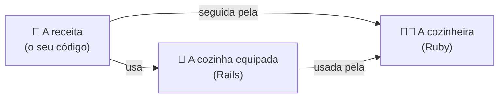
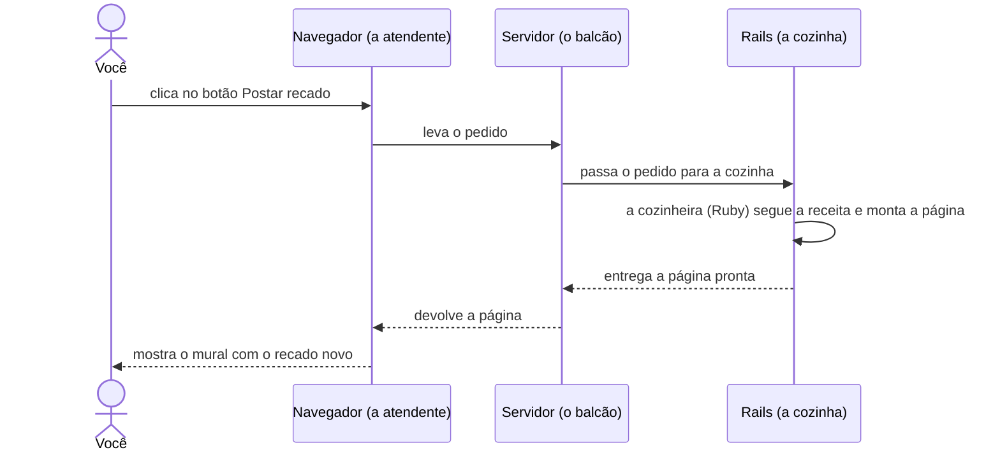
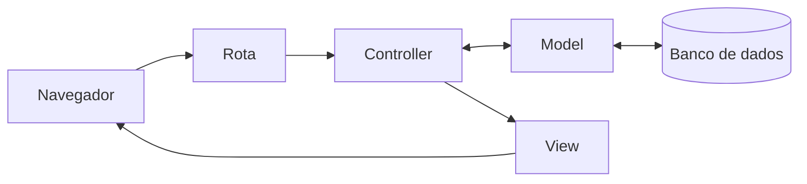

# Como começar o projeto?

Tempo: uns 30 minutos.
{: .fs-5 }

## O desafio

Você já tem um plano para o mural, mas ele ainda está no papel. Como ele vira um site que você abre no navegador e usa de verdade?

Um site começa como **texto**: arquivos com instruções escritas numa linguagem de programação. É parecido com uma receita: sozinha, ela não faz nada; alguém precisa ler e seguir cada passo.

No app Mural de recados:

- O seu código é a **receita**.
- O **Ruby** é a **cozinheira**: entende a língua em que a receita está escrita e segue cada passo.
- O **Rails** é uma **cozinha já equipada**, com utensílios e preparos básicos prontos (feitos em Ruby também). Você não precisa fazer a massa do zero: pode se concentrar no que é especial no seu prato.



Mas um site não é um prato que se prepara uma vez só. Ele funciona mais como um restaurante: cada vez que alguém abre o app ou clica num botão, faz um **pedido**, e a página é preparada na hora. Acompanhe um pedido:



Este diagrama é uma versão simplificada. O servidor já vem junto com o Rails: quando você cria um app Rails, ele vem pronto para usar. E, nos próximos capítulos, você vai descobrir o que acontece dentro da cozinha.

Para o app Mural de recados conseguir atender esses pedidos, do que ele precisa?

## Pense antes de programar

Reserve uns 5 minutos. Não existe resposta errada.

- Olhe o diagrama: o que precisa existir para um pedido ser atendido? Faça uma lista.
- O navegador está no seu computador. E o resto, onde poderia ficar?

## Compare com o nosso plano

<details markdown="1">
<summary>Abrir o nosso plano</summary>

Para o app funcionar, a gente precisa de quatro coisas:

| O que precisa | Papel | Onde fica |
|---|---|---|
| Os arquivos com o código | Dizem o que o app deve fazer | Num **repositório** no GitHub |
| Um computador que entende Ruby | Lê e executa o código | No seu computador, no **GitHub Codespaces** ou em outro computador na internet |
| Um lugar para os dados | Guarda as informações do app, como os recados do nosso mural | Num **banco de dados** (aparece no próximo capítulo) |
| Um programa que cuida da conversa com o navegador | Recebe o que o navegador pede e devolve as páginas | No mesmo computador que roda o Ruby e o Rails: ele já vem pronto quando você cria o app |

Quando você abre um site na internet, o código dele não está no seu computador: está num computador em outro lugar, que manda as páginas para você. Com o app Mural de recados vai ser igual, só que o "outro lugar", por enquanto, é o seu codespace.

Tudo isso pode ficar no seu próprio computador: é só instalar o Ruby e o Rails. Neste guia, a gente usa o codespace, um computador emprestado na nuvem que já vem preparado, para você começar a programar sem gastar tempo com instalação.

</details>

## Mão na massa

Você vai precisar de uma conta no GitHub. Se ainda não tem, veja como criar em [Instalação]({{ site.baseurl }}).

### 1. Crie o seu repositório

Um **repositório** é uma pasta no GitHub que guarda todos os arquivos de um projeto. A Rails Girls SP preparou um modelo de repositório com tudo o que o seu codespace precisa.

1. Abra o modelo do app: TODO: link para o repositório-modelo da Rails Girls SP.
2. Clique no botão **Use this template** e depois em **Create a new repository**.
3. Em **Repository name**, escreva `mural-de-recados`.
4. Clique em **Create repository**.

**Confira:** você está na página do seu repositório, com o seu nome de usuária antes de `/mural-de-recados`.

### 2. Abra o seu codespace

Um **codespace** é um computador na nuvem, ligado ao seu repositório. Você usa pelo navegador.

1. Na página do repositório, clique no botão verde **Code**.
2. Escolha a aba **Codespaces** e clique em **Create codespace on main**.

**Preveja:** o que você acha que vai abrir?

Na primeira vez, o codespace leva alguns minutos para ficar pronto: ele está instalando o Rails para você. Espere o terminal, na parte de baixo da tela, terminar de mostrar mensagens.

**Confira:** a tela tem três áreas.

- À esquerda, o **Explorer**: a lista de arquivos do projeto.
- No meio, o **editor**: onde os arquivos abrem quando você clica neles.
- Embaixo, o **terminal**: onde você digita comandos. Se ele não aparecer, abra pelo menu ☰ → **Terminal** → **New Terminal**. Veja mais sobre o terminal em [Terminal básico]({{ site.baseurl }}).

### 3. Confira as ferramentas

No terminal, digite:

```
ruby -v
```

E depois:

```
rails -v
```

**Confira:** o primeiro comando mostra a versão do Ruby, e o segundo, a versão do Rails. Se aparecerem números de versão, as ferramentas estão prontas.

### 4. Crie o app

**Preveja:** você vai rodar um único comando. Quantos arquivos você acha que ele vai criar? Anote um número.

No terminal, digite (o ponto no final faz parte do comando):

```
rails new .
```

O comando leva um ou dois minutos. Ele cria os arquivos e depois baixa as bibliotecas que o Rails usa.

**Confira:** o terminal mostrou uma lista enorme de linhas começando com `create`, e o Explorer agora tem várias pastas novas, como `app`, `config` e `db`. Compare com o número que você anotou.

### 5. Ligue o servidor

No terminal, digite:

```
bin/rails server
```

**Preveja:** o que vai acontecer com o terminal depois desse comando?

**Confira:**

- O terminal mostra algumas mensagens e fica parado, sem voltar para o lugar de digitar. Isso é normal: o servidor está ligado, esperando visitas.
- No canto da tela, aparece um aviso dizendo que a aplicação está rodando na porta 3000. Clique em **Open in Browser**.
- Abre uma aba nova com a página de boas-vindas do Rails.

Essa é a primeira página do seu app Mural de recados. Ainda não tem nenhum recado, mas o app já existe!

## Entenda

### O que o `rails new` fez

O **Rails** é um **framework**: um conjunto de ferramentas que já resolve o que quase todo site precisa, para você se concentrar no que é só do seu projeto. O `rails new` montou a estrutura inteira de um site em segundos.

Das muitas pastas criadas, três importam agora:

- **`app`**: o código do app. É aqui que você vai trabalhar na maior parte do tempo.
- **`config`**: as configurações, como o endereço de cada página.
- **`db`**: tudo sobre o banco de dados, onde os recados vão ficar guardados.

O resto existe, funciona e pode ficar quieto por enquanto.

### O que é o servidor

O **servidor** é um programa que fica esperando o navegador pedir uma página e responde com ela. Enquanto ele está ligado, o terminal fica ocupado com ele. Se o servidor desligar, ninguém consegue abrir o app.

O endereço da aba que abriu termina em `app.github.dev`: é o endereço do seu app dentro do codespace. Por enquanto, só você consegue abrir.

### Você está aqui



Todas as peças desse caminho já existem no seu app, mas ainda estão vazias. Nos próximos capítulos, você vai preencher uma por uma. Veja o que cada palavra quer dizer no [glossário]({{ site.baseurl }}).

### Não existem perguntas bobas

**Preciso deixar o terminal do servidor aberto?**
Sim, enquanto quiser ver o app. Para digitar outros comandos, abra um terminal novo pelo botão **+** do terminal.

**O codespace fica ligado para sempre?**
Não. Ele desliga sozinho depois de um tempo sem uso, mas os seus arquivos ficam guardados. Para voltar, abra [github.com/codespaces](https://github.com/codespaces), clique no seu codespace e ligue o servidor de novo.

**Os arquivos estão no meu computador?**
Quando você usa o codespace, não: eles ficam na nuvem. Por isso você pode continuar de outro computador, é só entrar na sua conta do GitHub.

## Quebre de propósito

1. Clique no terminal onde o servidor está rodando e aperte **Ctrl+C**. O servidor desliga e o terminal volta para o lugar de digitar.
2. Volte para a aba do app e recarregue a página.

**Preveja:** o que vai aparecer?

Em vez da página do Rails, aparece uma página de erro: não tem ninguém do outro lado para responder. Ligue o servidor de novo com `bin/rails server`, recarregue a aba e tudo volta.

## E se fosse com IA?

<details markdown="1">
<summary>Abrir</summary>

O `rails new` também gera código: dezenas de arquivos com um único comando. Mas ele é **previsível**: o mesmo comando sempre gera os mesmos arquivos, do jeito que o Rails recomenda.

Uma IA também gera código, só que cada resposta pode vir diferente, e você precisa conferir tudo o que ela fez.

Saber o que as ferramentas do Rails já fazem sozinhas evita pedir para a IA uma coisa que um comando resolve, mais rápido e sem surpresas.

</details>

## Não esqueça

- Um site precisa de arquivos com código, um computador que rode esse código e um servidor que entregue as páginas.
- O **repositório** guarda os arquivos; o **codespace** é o computador na nuvem onde você trabalha.
- `rails new` cria a estrutura inteira do app; por enquanto, importam as pastas `app`, `config` e `db`.
- O app só abre enquanto o servidor estiver ligado.

## Teste-se

1. O que acontece com o app se você desligar o servidor?
2. Em qual pasta vai ficar a maior parte do código do app?
3. Qual a diferença entre o repositório e o codespace?

<details markdown="1">
<summary>Ver respostas</summary>

1. Ele para de abrir: o navegador mostra um erro, porque não tem ninguém para responder. Basta ligar o servidor de novo com `bin/rails server`.
2. Na pasta `app`.
3. O repositório é onde os arquivos ficam guardados, no GitHub. O codespace é o computador na nuvem onde você abre esses arquivos, roda comandos e liga o servidor.

</details>

## Travou?

**O terminal diz `rails: command not found`.**
O codespace ainda está instalando o Rails. Espere o terminal parar de mostrar mensagens e tente de novo. Se o erro continuar, peça ajuda.

**O aviso da porta 3000 não apareceu, ou você fechou sem querer.**
No painel de baixo, abra a aba **Ports**, encontre a porta 3000 e clique no ícone de globo para abrir no navegador.

**A página mostra o erro "Blocked hosts".**
O Rails bloqueou o endereço do codespace. Peça ajuda a uma mentora ou veja a solução nas notas das mentoras.

**O codespace desligou.**
Abra [github.com/codespaces](https://github.com/codespaces), clique no seu codespace e, quando ele abrir, ligue o servidor de novo com `bin/rails server`.

<details markdown="1">
<summary>Código completo deste passo</summary>

Neste capítulo, todo o código foi criado pelo `rails new`. Não tem nada para copiar.

</details>

<!-- TODO: decisão pendente: fazer o primeiro commit no fim deste capítulo? (ver comece-aqui/git-basico.md) -->

Mentoras: código de referência na tag `passo-01` do repositório do app.
