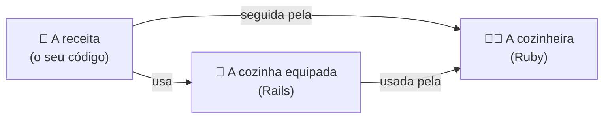
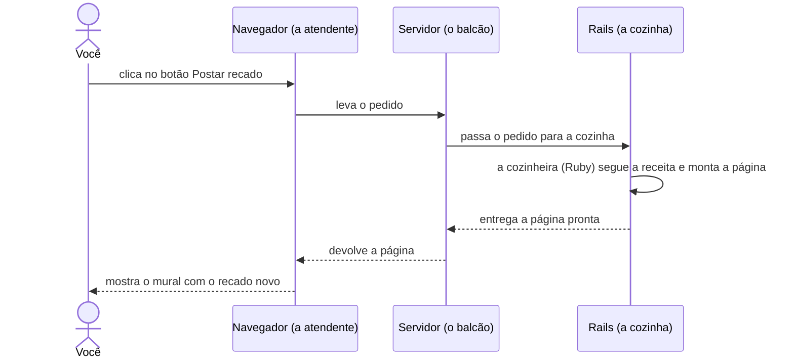

# Por onde começar?

Tempo: uns 30 minutos.
{: .fs-5 }

## O desafio

Você já tem um plano para o mural, mas ele ainda está no papel. Como ele vira um site que você abre no navegador e usa de verdade?

Um site começa como **texto**: arquivos com instruções escritas numa linguagem de programação. É parecido com uma receita: sozinha, ela não faz nada; alguém precisa ler e seguir cada passo.

No app Mural de recados:

- O seu código é a **receita**.
- O **Ruby** é a **cozinheira**: entende a língua em que a receita está escrita e segue cada passo.
- O **Rails** é uma **cozinha já equipada**, com utensílios e preparos básicos prontos (feitos em Ruby também). Você não precisa fazer a massa do zero: pode se concentrar no que é especial no seu prato.

Mas um site não é um prato que se prepara uma vez só. Ele funciona mais como um restaurante: cada vez que alguém abre o app ou clica num botão, faz um **pedido**, e a página é preparada na hora. Acompanhe um pedido:

Este diagrama é uma versão simplificada. O servidor já vem junto com o Rails: quando você cria um app Rails, ele vem pronto para usar. E, nos próximos capítulos, você vai descobrir o que acontece dentro da cozinha.

Para o app Mural de recados conseguir atender esses pedidos, do que ele precisa?

## Pense antes de programar

Reserve uns 5 minutos. Não existe resposta errada.

- Olhe o diagrama: o que precisa existir para um pedido ser atendido? Faça uma lista.
- O navegador está no seu computador. E o resto, onde poderia ficar?

## Compare com o nosso plano

Abrir o nosso plano

Para o app funcionar, a gente precisa de quatro coisas:

| O que precisa | Papel | Onde fica |
|---|---|---|
| Os arquivos com o código | Dizem o que o app deve fazer | Num **repositório** no GitHub |
| Um computador que entende Ruby | Lê e executa o código | No seu computador, no **GitHub Codespaces** ou em outro computador na internet |
| Um lugar para os dados | Guarda as informações do app, como os recados do nosso mural | Num **banco de dados** (aparece no próximo capítulo) |
| Um programa que cuida da conversa com o navegador | Recebe o que o navegador pede e devolve as páginas | No mesmo computador que roda o Ruby e o Rails: ele já vem pronto quando você cria o app |

Quando você abre um site na internet, o código dele não está no seu computador: está num computador em outro lugar, que manda as páginas para você. Com o app Mural de recados vai ser igual, só que o "outro lugar", por enquanto, é o seu codespace.

Tudo isso pode ficar no seu próprio computador: é só instalar o Ruby e o Rails. Neste guia, a gente usa o codespace, um computador emprestado na nuvem que já vem preparado, para você começar a programar sem gastar tempo com instalação.

## Mão na massa

Agora é com você: siga os passos em [Mão na massa]({{ site.baseurl }}). Quando terminar, siga para [O que aconteceu?]({{ site.baseurl }}).

## O que aconteceu?

Terminou os passos? Em [O que aconteceu?]({{ site.baseurl }}) você entende cada passo, quebra o app de propósito, vê o que muda quando a IA gera código e se testa.
