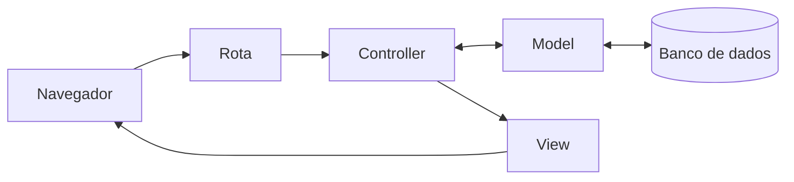

# O que aconteceu?

Por dentro do app

O **Rails** é um **framework**: um conjunto de ferramentas que já resolve o que quase todo site precisa, para você se concentrar no que é só do seu projeto. O `rails new` montou a estrutura inteira de um site em segundos.

Das muitas pastas criadas, três importam agora:

- **`app`**: o código do app. É aqui que você vai trabalhar na maior parte do tempo.
- **`config`**: as configurações, como o endereço de cada página.
- **`db`**: tudo sobre o banco de dados, onde os recados vão ficar guardados.

O resto existe, funciona e pode ficar quieto por enquanto.

O **servidor** é um programa que fica esperando o navegador pedir uma página e responde com ela. Enquanto ele está ligado, o terminal fica ocupado com ele. Se o servidor desligar, ninguém consegue abrir o app.

O endereço da aba que abriu termina em `app.github.dev`: é o endereço do seu app dentro do codespace. Por enquanto, só você consegue abrir.

Você está aqui: este é o caminho que uma requisição percorre dentro do app.

Todas as peças desse caminho já existem no seu app, mas ainda estão vazias. Nos próximos capítulos, você vai preencher uma por uma. Veja o que cada palavra quer dizer no [glossário]({{ site.baseurl }}).

Não existem perguntas bobas

Preciso deixar o terminal do servidor aberto?

Sim, enquanto quiser ver o app. Para digitar outros comandos, abra um terminal novo pelo botão **+** do terminal.

Então um site fica com o terminal aberto, rodando o servidor?

Não exatamente. Os sites que você usa no dia a dia ficam num [servidor]({{ site.baseurl }}#servidor), um computador que fica ligado o tempo todo. Lá, o programa do servidor é ligado sozinho quando o computador liga e volta a funcionar se cair, sem ninguém com um terminal aberto. O terminal do codespace é para quando você está construindo o app: você liga o servidor para testar e desliga quando termina. No capítulo [Como mostrar o mural de recados para o mundo?]({{ site.baseurl }}), você vai colocar o seu app num servidor desses.

É assim que roda uma aplicação de verdade?

Quase. Um app costuma rodar em pelo menos dois **ambientes**:

- **Desenvolvimento** (*development*): onde você constrói e testa, como no seu codespace. Aqui, o Rails mostra detalhes quando algo dá errado e percebe sozinho quando você muda o código, para você ver o resultado na hora.
- **Produção** (*production*): a versão que as pessoas usam de verdade, num servidor. Aqui, o app é configurado para ser mais rápido e mais seguro, esconde os detalhes dos erros e guarda os dados reais.

O código é o mesmo, o que muda é a configuração. Quando você ligou o servidor, o terminal avisou em qual ambiente ele estava: `application starting in development`.

O codespace fica ligado para sempre?

Não. Ele desliga sozinho depois de um tempo sem uso, mas os seus arquivos ficam guardados. Veja como voltar em [Travou?]({{ site.baseurl }}#travou), no fim de Mão na massa.

Os arquivos estão no meu computador?

Quando você usa o codespace, não: eles ficam na nuvem. Por isso você pode continuar de outro computador, é só entrar na sua conta do GitHub.

Quebre de propósito Opcional

1. Clique no terminal onde o servidor está rodando e aperte **Ctrl+C**. O servidor desliga e o terminal volta para o lugar de digitar.
2. Volte para a aba do app e recarregue a página.

**Dê um palpite:** o que vai aparecer?

Em vez da página do Rails, aparece uma página de erro: não tem ninguém do outro lado para responder. Ligue o servidor de novo com `bin/rails server`, recarregue a aba e tudo volta.

Preciso de IA para este capítulo?

Não. Tudo aqui é feito com cliques e com poucos comandos (`ruby -v`, `rails -v`, `rails new .` e `bin/rails server`). Uma IA não deixaria nada mais rápido e ainda poderia atrapalhar: sugerir comandos de outro sistema, criar arquivos que você não pediu ou pular justamente os passos que mostram como o app funciona.

O codespace tem um painel de chat com IA, à direita. Se quiser usar, trate a IA como uma tutora, não como alguém que faz por você (veja como começar a conversa em [Usando IA como tutora]({{ site.baseurl }})):

- **Peça explicações.** Por exemplo: "O que faz o comando `rails new .`?" ou "O que quer dizer esta mensagem de erro?".
- **Peça para ela te guiar,** um passo de cada vez, e faça você cada passo.
- **Nunca rode um comando que você não entendeu.** Se a IA sugerir um comando, pergunte o que ele faz antes de rodar.
- **Não deixe a IA rodar comandos ou mudar arquivos sozinha.** Você precisa saber o que mudou no seu app, e por quê.

**A IA e o `rails new`**

O `rails new` também gera código: dezenas de arquivos com um único comando. Mas ele é **previsível**: o mesmo comando sempre gera os mesmos arquivos, do jeito que o Rails recomenda.

Uma IA também gera código, só que cada resposta pode vir diferente, e você precisa conferir tudo o que ela fez.

Saber o que as ferramentas do Rails já fazem sozinhas evita pedir para a IA uma coisa que um comando resolve, mais rápido e sem surpresas.

Não esqueça

- Um site precisa de arquivos com código, um computador que rode esse código e um servidor que entregue as páginas.
- O **repositório** guarda os arquivos; o **codespace** é o computador na nuvem onde você trabalha.
- `rails new` cria a estrutura inteira do app; por enquanto, importam as pastas `app`, `config` e `db`.
- O app só abre enquanto o servidor estiver ligado.
- Um **commit** guarda como o projeto está agora; o **Sync Changes** manda esse registro para o GitHub.

Quiz

1. O que acontece com o app se você desligar o servidor?
2. Em qual pasta vai ficar a maior parte do código do app?
3. Qual a diferença entre o repositório e o codespace?

Ver respostas

1. Ele para de abrir: o navegador mostra um erro, porque não tem ninguém para responder. Basta ligar o servidor de novo com `bin/rails server`.
2. Na pasta `app`.
3. O repositório é onde os arquivos ficam guardados, no GitHub. O codespace é o computador na nuvem onde você abre esses arquivos, roda comandos e liga o servidor.

Para saber mais

Vídeos do Rails Girls São Paulo 2025:

- [Introdução a Ruby](https://www.youtube.com/watch?v=hkSSRm8SQDU), com Isadora Silva.
- [Introdução a Ruby on Rails](https://www.youtube.com/watch?v=6vSvbInY0Bc), com Beatriz Mitre.

## E agora?

O app existe e está guardado no GitHub. Próximo desafio: [Como guardar os recados?]({{ site.baseurl }})
