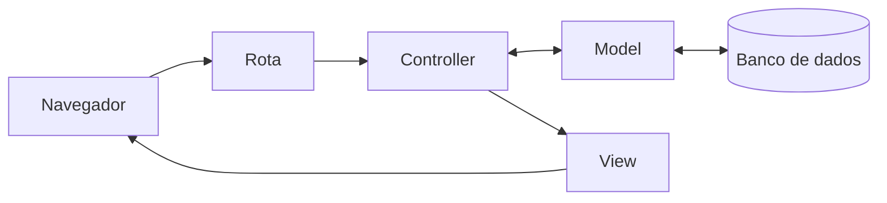

# O que aconteceu?

## O que o `rails new` fez

O **Rails** é um **framework**: um conjunto de ferramentas que já resolve o que quase todo site precisa, para você se concentrar no que é só do seu projeto. O `rails new` montou a estrutura inteira de um site em segundos.

Das muitas pastas criadas, três importam agora:

- **`app`**: o código do app. É aqui que você vai trabalhar na maior parte do tempo.
- **`config`**: as configurações, como o endereço de cada página.
- **`db`**: tudo sobre o banco de dados, onde os recados vão ficar guardados.

O resto existe, funciona e pode ficar quieto por enquanto.

## O que é o servidor

O **servidor** é um programa que fica esperando o navegador pedir uma página e responde com ela. Enquanto ele está ligado, o terminal fica ocupado com ele. Se o servidor desligar, ninguém consegue abrir o app.

O endereço da aba que abriu termina em `app.github.dev`: é o endereço do seu app dentro do codespace. Por enquanto, só você consegue abrir.

## Você está aqui

Todas as peças desse caminho já existem no seu app, mas ainda estão vazias. Nos próximos capítulos, você vai preencher uma por uma. Veja o que cada palavra quer dizer no [glossário]({{ site.baseurl }}).

## Para saber mais

Vídeos do Rails Girls São Paulo 2025:

- [Introdução a Ruby](https://www.youtube.com/watch?v=hkSSRm8SQDU), com Isadora Silva.
- [Introdução a Ruby on Rails](https://www.youtube.com/watch?v=6vSvbInY0Bc), com Beatriz Mitre.

## Não existem perguntas bobas

**Preciso deixar o terminal do servidor aberto?**
Sim, enquanto quiser ver o app. Para digitar outros comandos, abra um terminal novo pelo botão **+** do terminal.

**O codespace fica ligado para sempre?**
Não. Ele desliga sozinho depois de um tempo sem uso, mas os seus arquivos ficam guardados. Para voltar, abra [github.com/codespaces](https://github.com/codespaces), clique no seu codespace e ligue o servidor de novo.

**Os arquivos estão no meu computador?**
Quando você usa o codespace, não: eles ficam na nuvem. Por isso você pode continuar de outro computador, é só entrar na sua conta do GitHub.

## Quebre de propósito

1. Clique no terminal onde o servidor está rodando e aperte **Ctrl+C**. O servidor desliga e o terminal volta para o lugar de digitar.
2. Volte para a aba do app e recarregue a página.

**Dê um palpite:** o que vai aparecer?

Em vez da página do Rails, aparece uma página de erro: não tem ninguém do outro lado para responder. Ligue o servidor de novo com `bin/rails server`, recarregue a aba e tudo volta.

## E se fosse com IA?

Abrir

O `rails new` também gera código: dezenas de arquivos com um único comando. Mas ele é **previsível**: o mesmo comando sempre gera os mesmos arquivos, do jeito que o Rails recomenda.

Uma IA também gera código, só que cada resposta pode vir diferente, e você precisa conferir tudo o que ela fez.

Saber o que as ferramentas do Rails já fazem sozinhas evita pedir para a IA uma coisa que um comando resolve, mais rápido e sem surpresas.

## Não esqueça

- Um site precisa de arquivos com código, um computador que rode esse código e um servidor que entregue as páginas.
- O **repositório** guarda os arquivos; o **codespace** é o computador na nuvem onde você trabalha.
- `rails new` cria a estrutura inteira do app; por enquanto, importam as pastas `app`, `config` e `db`.
- O app só abre enquanto o servidor estiver ligado.
- Um **commit** guarda como o projeto está agora; o **Sync Changes** manda esse registro para o GitHub.

## Teste-se

1. O que acontece com o app se você desligar o servidor?
2. Em qual pasta vai ficar a maior parte do código do app?
3. Qual a diferença entre o repositório e o codespace?

Ver respostas

1. Ele para de abrir: o navegador mostra um erro, porque não tem ninguém para responder. Basta ligar o servidor de novo com `bin/rails server`.
2. Na pasta `app`.
3. O repositório é onde os arquivos ficam guardados, no GitHub. O codespace é o computador na nuvem onde você abre esses arquivos, roda comandos e liga o servidor.

## Travou?

**O terminal diz `rails: command not found`.**
O codespace ainda está instalando o Rails. Espere o terminal parar de mostrar mensagens e tente de novo. Se o erro continuar, peça ajuda.

**O aviso da porta 3000 não apareceu, ou você fechou sem querer.**
No painel de baixo, abra a aba **Ports**, encontre a porta 3000 e clique no ícone de globo, na coluna **Forwarded Address**, para abrir no navegador.

**A página mostra o erro "Blocked hosts".**
O Rails bloqueou o endereço do codespace. Peça ajuda a uma mentora ou veja a solução nas notas das mentoras.

**O codespace desligou ou você fechou a aba.**
Abra [github.com/codespaces](https://github.com/codespaces) e clique no seu codespace. Quando ele abrir, ligue o servidor de novo com `bin/rails server`.

O codespace também aparece na página do repositório, no botão **Code**, aba **Codespaces**:

**Fechou sem dar Sync das mudanças?**
Calma: nada se perdeu. Os seus arquivos e o seu commit continuam guardados no codespace. Abra o codespace de novo (veja o item anterior) e, no painel **Source Control**, clique em **Sync Changes**. Se você ainda não tinha feito o commit, faça os passos do commit antes.

Código completo deste passo

Neste capítulo, todo o código foi criado pelo `rails new`. Não tem nada para copiar.

Mentoras: código de referência na tag `passo-01` do repositório do app.

## E agora?

O app existe e está guardado no GitHub. Próximo desafio: [Onde os recados ficam guardados?]({{ site.baseurl }})
