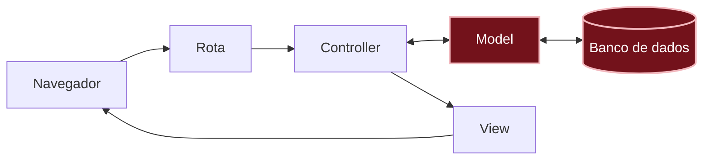

# O que aconteceu?

<details class="passo" markdown="1" open>
<summary>Por dentro do app</summary>

Neste capítulo, três peças trabalharam juntas:

- O **[model]({{ site.baseurl }}#model)** (modelo, em português) `Message` é a parte do app que cuida dos recados: guarda, busca, conta recados e apaga. Foi com ele que você conversou no console, com `Message.create` e `Message.count`. Se você abrir o arquivo dele, `app/models/message.rb`, vai ver só duas linhas. Mesmo assim, ele já sabe guardar, buscar, contar e apagar, porque esse código já vem pronto no Rails.
- A **[migration]({{ site.baseurl }}#migration)** (migração, em português) é a instrução para criar a tabela no banco de dados. Ela só descreve a mudança; quem aplica é o `bin/rails db:migrate`.
- O **[banco de dados]({{ site.baseurl }}#banco-de-dados)** é onde os recados ficam guardados de verdade, para serem usados depois. No app Mural de recados, ele é um banco **SQLite**: um arquivo só, `storage/development.sqlite3`, que o Rails gerencia por você.

**Por que precisamos do model e da migration?** Pense na planilha de recados:

| | Migration | Model |
|---|---|---|
| **Na planilha** | Monta a planilha: cria a aba e dá nome às colunas | É a assistente especialista que só cuida dessa planilha: escreve linhas, procura, conta e apaga |
| **Quando trabalha** | Uma vez, quando a estrutura muda | O tempo todo, enquanto o app funciona |
| **Neste capítulo** | `bin/rails db:migrate` criou a tabela `messages` | `Message.create` escreveu o recado da Ana, e `Message.count` contou os recados |

São trabalhos diferentes: um prepara o lugar, o outro trabalha com o que está lá dentro. Se um dia o recado ganhar uma informação nova, vai precisar de uma migration nova para criar a coluna, e o model passa a usar essa coluna.

O Rails liga o model à tabela pelo nome: o model `Message`, no singular e com letra maiúscula, conversa com a tabela `messages`, no plural e em minúsculas. Você não precisou configurar nada: é uma **[convenção]({{ site.baseurl }}#convencao)** do Rails, um combinado sobre como dar nome às coisas.

Você está aqui: este é o caminho que uma requisição percorre dentro do app.



Neste capítulo, você construiu as duas peças destacadas no diagrama: o model e a tabela no banco de dados. O navegador ainda não chega nelas: isso vem nos próximos capítulos.

</details>

<details class="passo" markdown="1">
<summary>Não existem perguntas bobas</summary>

<details class="pergunta" markdown="1">
<summary>Por que o model se chama Message e a tabela, messages?</summary>

É uma convenção do Rails: o model representa **um** recado, então fica no singular; a tabela guarda **vários**, então fica no plural. Seguindo a convenção, o Rails liga os dois sozinho.

</details>

<details class="pergunta" markdown="1">
<summary>Por que os nomes no código estão em inglês?</summary>

Quase todo código no mundo, incluindo o próprio Rails, usa nomes em inglês, e seguir esse costume deixa o seu código parecido com os exemplos que você vai encontrar na documentação e na internet. Além disso, o Rails faz o plural seguindo as regras do inglês: um model chamado `Mensagem` viraria a tabela `mensagems`. Por isso, no código o recado se chama `Message`, e o guia mostra a tradução de cada nome.

</details>

<details class="pergunta" markdown="1">
<summary>E se eu rodar <code>bin/rails db:migrate</code> duas vezes?</summary>

Nada acontece na segunda vez. O Rails anota no próprio banco de dados quais migrations já rodaram e só aplica as que ainda faltam.

</details>

<details class="pergunta" markdown="1">
<summary>Por que o nome da migration começa com data e hora? <span class="label label-purple">Para ir além</span></summary>

O nome do arquivo é parecido com `20261003120000_create_messages.rb`. O começo é a data e a hora em que a migration foi criada: ano, mês, dia, hora, minuto e segundo (`2026-10-03 12:00:00`). Esse número tem duas funções:

- **Pôr as migrations em ordem.** Ao longo de um projeto, o banco de dados muda muitas vezes: primeiro cria a tabela, depois acrescenta uma coluna, depois outra. Elas precisam rodar sempre na ordem em que foram criadas, e a data e a hora garantem isso.
- **Não repetir números.** Se as migrations fossem numeradas 1, 2, 3…, duas pessoas trabalhando no mesmo projeto ao mesmo tempo poderiam criar duas migrations "número 4". Com a data e a hora, isso quase nunca acontece.

O Rails também usa esse número para lembrar o que já rodou: ele anota no próprio banco de dados o número de cada migration aplicada. É por isso que rodar `bin/rails db:migrate` duas vezes não faz nada na segunda.

</details>

<details class="pergunta" markdown="1">
<summary>O console é o app?</summary>

É o mesmo app, mas sem o navegador: em vez de clicar em botões, você escreve código Ruby e vê a resposta na hora. É ótimo para testar coisas rápidas, como você fez com o `Message.create`.

</details>

<details class="pergunta" markdown="1">
<summary>Onde está o recado da Ana agora?</summary>

Numa linha da tabela `messages`, dentro do arquivo `storage/development.sqlite3`. Esse arquivo não vai para o GitHub (o `.gitignore` do Rails deixa ele de fora), então o recado existe só no seu codespace.

{: .atencao }
Não apague nem edite o arquivo `storage/development.sqlite3`. Ele não é um arquivo de texto: abrir e salvar pelo editor pode estragar o banco de dados, e apagar faz todos os recados sumirem. Para mexer nos recados, use o console ou, a partir dos próximos capítulos, o próprio app.

</details>

<details class="pergunta" markdown="1">
<summary>Todo app guarda os dados num arquivo assim? <span class="label label-purple">Para ir além</span></summary>

Não. Em muitos apps que estão no ar, o banco de dados fica num programa separado, às vezes até num computador só para ele, como o PostgreSQL ou o MySQL. Para aprender e para começar um projeto, o SQLite funciona muito bem, e o jeito de usar o model é praticamente o mesmo nos dois casos.

</details>

</details>

<details class="passo" markdown="1">
<summary>Quebre de propósito <span class="label label-blue">Opcional</span></summary>

Abra o console de novo com `bin/rails console` e tente guardar um recado com uma informação que não existe:

```ruby
Message.create(author: "Bia", title: "Oi")
```

**Dê um palpite:** o que vai acontecer?

O console mostra um erro parecido com `unknown attribute 'title' for Message`. Leia a mensagem com calma: ela diz exatamente o problema, `title` (título) não é uma informação que o recado tem. A tabela só tem as colunas que a migration criou.

Agora tente guardar um recado **sem nada**:

```ruby
Message.create
```

**Dê um palpite:** vai dar erro?

Não dá! Para ver o que foi guardado, peça o último recado:

```ruby
Message.last
```

O console mostra algo parecido com isto:

```
#<Message:0x... id: 2, author: nil, content: nil, created_at: "2026-10-03 12:10:00", updated_at: "2026-10-03 12:10:00">
```

O [`nil`]({{ site.baseurl }}#nil) quer dizer "nada": o recado tem número e data, mas não tem autora nem mensagem. O Rails guardou um recado vazio, porque ninguém disse a ele que isso é proibido. Guarde essa observação: ela é o assunto do capítulo [E se alguém mandar um recado vazio?]({{ site.baseurl }}).

Para apagar esse recado vazio, digite:

```ruby
Message.last.destroy
```

Depois, saia do console com `exit`.

</details>

<details class="passo" markdown="1">
<summary>Preciso de IA para este capítulo?</summary>

Não. O `bin/rails generate model` já escreve o model e a migration para você, sempre do mesmo jeito, seguindo as convenções do Rails.

Se quiser usar uma IA, use para entender, e não para fazer:

- Peça para ela explicar a migration linha por linha.
- Se ela sugerir um código diferente do que o `generate` criou, compare com o seu plano. É comum a IA acrescentar coisas que você não pediu, como informações a mais no recado. Elas até podem ser boas ideias, mas não fazem parte desta etapa do MVP. Lembre-se: num [MVP]({{ site.baseurl }}#como-os-projetos-crescem), a gente quer construir o mínimo para o mural de recados já funcionar e ser útil, e só depois acrescentar o resto, uma etapa de cada vez. Focar no mínimo ajuda a gastar tempo só com o que faz diferença para quem vai usar: o app fica pronto mais cedo, as pessoas já podem usar, e você descobre com elas o que vale a pena fazer depois.

</details>

<details class="passo" markdown="1">
<summary>Não esqueça</summary>

- Um **model** representa uma informação do app, como o recado, e conversa com o banco de dados.
- Uma **migration** descreve uma mudança no banco de dados; o `bin/rails db:migrate` aplica a mudança.
- O model `Message` (singular) usa a tabela `messages` (plural): é uma convenção do Rails.
- No código, os nomes ficam em inglês: `Message` é o recado, `author` é a autora e `content` é a mensagem.
- O Rails cria sozinho as colunas `id`, `created_at` e `updated_at`.
- O que está no banco de dados continua lá mesmo depois de fechar o console ou o navegador.

</details>

<details class="passo" markdown="1">
<summary>Quiz</summary>

1. Qual é a diferença entre o model e a migration?
2. Você criou a migration, mas esqueceu de rodar o `bin/rails db:migrate`. O que acontece quando tenta usar o `Message` no console?
3. Por que o recado da Ana continuou lá depois de você fechar o console?

<details markdown="1">
<summary>Ver respostas</summary>

1. A migration é a instrução para criar ou mudar a tabela no banco de dados. O model é quem usa essa tabela dentro do app, para guardar e buscar recados.
2. O console reclama que a tabela não existe (`no such table: messages`), porque a instrução ainda não foi aplicada.
3. Porque o recado foi guardado no banco de dados, e não no console. O console é só um jeito de conversar com o app.

</details>

</details>

<details class="passo" markdown="1">
<summary>Para saber mais</summary>

Guias oficiais do Rails, em inglês:

- [Active Record Basics](https://guides.rubyonrails.org/active_record_basics.html): como os models funcionam.
- [Active Record Migrations](https://guides.rubyonrails.org/active_record_migrations.html): tudo sobre migrations.
- [The Rails Command Line](https://guides.rubyonrails.org/command_line.html): os comandos `bin/rails`, como o `generate` e o `console`.

</details>

## E agora?

Os recados já ficam guardados, mas ainda não aparecem no navegador. Próximo desafio: [Como ver todos os recados?]({{ site.baseurl }})
