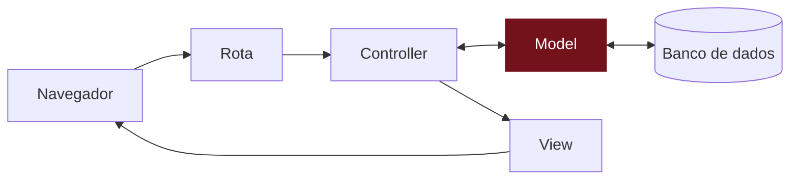

# O model Recado

## Você está aqui

## O que vamos fazer
TODO: objetivo do capítulo em 2–3 frases.

## Passo a passo
TODO: decisão pendente: usar `rails generate scaffold` (e depois explorar o código gerado) ou escrever model, controller e views à mão, parte por parte.

## O que aconteceu aqui?
TODO: explicação do conceito, sem jargão desnecessário.

## E a IA nisso?
TODO (opcional): só nos capítulos em que fizer sentido.

## Confira se deu certo
TODO: o que a participante deve ver na tela.
Código de referência deste passo: tag `passo-02` no repositório do app.

## Deu errado?
TODO: os 2–3 erros mais prováveis deste passo e como resolver.
