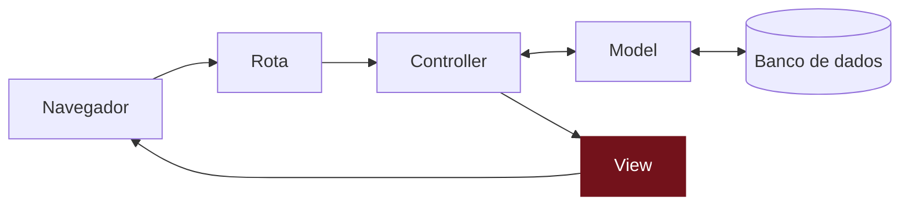

# Como ver todos os recados?

## O desafio
TODO: já existem recados guardados. Como eles aparecem no mural?

## Pense antes de programar
TODO: 5–10 minutos, no papel. Não existe resposta errada.

- Desenhe a tela do mural. O que aparece em cada card?
- Em que ordem os recados aparecem? Os mais novos primeiro?
- O que a tela mostra quando ainda não existe nenhum recado?

## Compare com o nosso plano

Abrir o nosso plano

TODO: telas, dados e regras que a gente planejou para este desafio.

## Mão na massa
TODO: decisão pendente: usar `rails generate scaffold` (e depois explorar o código gerado) ou escrever model, controller e views à mão, parte por parte.

TODO: em cada passo, um "Preveja" antes de rodar e um "Confira" logo depois.

## Entenda
TODO: explicação do conceito, sem jargão desnecessário; o termo técnico aparece aqui (e linka o glossário).

### Você está aqui

### Não existem perguntas bobas
TODO: 2–3 perguntas e respostas curtas.

## Quebre de propósito
TODO (opcional): uma mudança que causa erro de propósito e como ler a mensagem.

## E se fosse com IA?
TODO (opcional): transformar o plano do "Pense antes" num pedido para a IA e conferir o resultado contra as regras do plano.

## Não esqueça
TODO: 3–5 bullets.

## Teste-se
TODO: 2–3 perguntas.

Ver respostas

TODO

## Travou?
TODO: os 2–3 erros mais prováveis deste passo e como resolver.

Código completo deste passo

TODO: conteúdo de cada arquivo alterado neste capítulo.

Mentoras: código de referência na tag `passo-03` do repositório do app.
