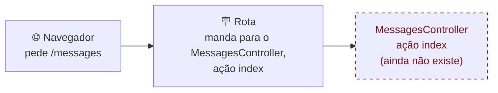
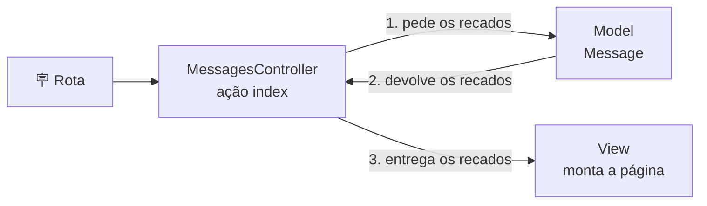
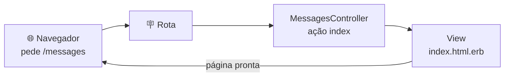

# Mão na massa

Travou em algum passo? Veja [Travou?](#travou), no fim da página.

Neste capítulo, você vai ver erros aparecerem no navegador, e isso faz parte: cada erro mostra a próxima peça que falta. Leia cada mensagem com calma, porque ela conta o que está faltando.

<details class="passo" markdown="1" open>
<summary>1. Ligue o servidor</summary>

Abra o seu codespace e ligue o servidor, se ele ainda não estiver ligado:

```
bin/rails server
```

Abra o app no navegador (pelo aviso **Open in Browser** ou pela aba **Ports**) e deixe essa aba aberta: você vai recarregar a página várias vezes neste capítulo.

Para os outros comandos, abra um terminal novo pelo botão **+**, como em [Como guardar os recados?]({{ site.baseurl }}).

**Confira:** o navegador mostra a página de boas-vindas do Rails, aquela do [capítulo 01]({{ site.baseurl }}).

Terminou? Abra o passo **2. Procure o mural de recados**

</details>

<details class="passo" markdown="1">
<summary>2. Procure o mural de recados</summary>

O mural de recados vai morar no endereço `/messages`. Vamos ver o que acontece se você tentar abrir esse endereço agora.

Na aba do app, clique na barra de endereço e acrescente `/messages` no fim, depois do `.app.github.dev`. O endereço fica parecido com isto:

```
https://seu-codespace-3000.app.github.dev/messages
```

Aperte **Enter**.

**Dê um palpite:** o que vai aparecer?

**Confira:** aparece uma página de erro, com o título **Routing Error** e a mensagem `No route matches [GET] "/messages"`.

Calma: esse erro é esperado! Leia a mensagem: o Rails está dizendo que não existe nenhuma **rota** (*route*) para o endereço `/messages`. Ele não sabe o que fazer com essa **[requisição]({{ site.baseurl }}#requisicao)**, que é o nome do pedido que o navegador faz ao app (em inglês, *request*). Deixe essa aba aberta: você vai recarregar essa página várias vezes.

Agora, abra o passo **3. Resolva o erro: crie a rota**

</details>

<details class="passo" markdown="1">
<summary>3. Resolva o erro: crie a rota</summary>

Uma **[rota]({{ site.baseurl }}#rota)** liga um endereço a uma parte do código. É como uma placa que diz: "quem pedir este endereço, vá até ali".


{: .ilustracao .ilustracao-secao }

Ilustração: [unDraw](https://undraw.co/)
{: .fs-2 .text-center }

No Explorer, abra o arquivo `config/routes.rb`. Ele tem várias linhas começando com `#`: são comentários, que o Rails ignora. Logo antes do último `end`, acrescente esta linha, **sem** o `#` na frente (com o `#`, ela vira comentário e o Rails ignora):

```ruby
  get "messages", to: "messages#index"
```

Salve o arquivo (**Cmd+S** no Mac, **Ctrl+S** no Windows e no Linux).

Essa linha quer dizer: "quando alguém pedir (`get`) o endereço `messages`, mande para o controller `messages`, ação `index`". O `messages#index` é o jeito do Rails de escrever "controller dos recados, ação index".

E por que `index`? Em inglês, *index* quer dizer índice, uma lista. No Rails, `index` é o nome que normalmente se usa para a parte que mostra uma lista de coisas. Como o mural de recados é uma lista de recados, escolhemos esse nome.

**Dê um palpite:** você criou a placa (a rota), mas ainda não criou o controller para onde ela aponta. O que você acha que vai acontecer quando o navegador pedir o `/messages` de novo?

Volte para a aba do app, que está no endereço `/messages`, e recarregue a página.

Recarregou a página e viu o novo erro? Agora, abra o passo **4. Ah não! Um novo erro!**

</details>

<details class="passo" markdown="1">
<summary>4. Ah não! Um novo erro!</summary>

**Confira:** aparece um erro diferente! Progresso! Agora a página de erro tem o título **ActionDispatch::MissingController in MessagesController#index** e a mensagem `uninitialized constant MessagesController`.

Compare com o erro anterior: antes, o Rails não tinha rota. Agora ele segue a placa até o `MessagesController`… e não encontra, porque ele ainda não existe.



A placa (a rota) aponta para um **[controller]({{ site.baseurl }}#controller)** (controlador, em português): a parte do app que recebe a requisição do navegador, depois que a rota encaminhou, e decide o que fazer com ela. É ele que junta os dados com a parte visual do app: no mural de recados, ele busca os recados e entrega para a página que mostra esses recados. Cada coisa que um controller sabe fazer se chama **[ação]({{ site.baseurl }}#acao)** (em inglês, *action*), e a `index`, como você viu na rota, é a que mostra a lista. Veja as outras ações no [glossário]({{ site.baseurl }}#acao).



O controller não guarda os recados nem desenha a página: ele pede os recados ao [model]({{ site.baseurl }}#model) `Message`, que você criou no capítulo anterior, e entrega para a view, que monta a página.

Terminou? Abra o passo **5. Gere o controller**

</details>

<details class="passo" markdown="1">
<summary>5. Gere o controller</summary>

Em vez de escrever o controller do zero, vamos pedir para o Rails gerar um controller vazio, com a ação `index` (a lista).

**Dê um palpite:** o `generate model` do capítulo anterior criou o model e a migration. O que você acha que o `generate controller` vai criar?

No terminal novo, digite:

```
bin/rails generate controller Messages index
```

**Confira:** o terminal mostra os arquivos criados, parecido com isto:

```
create  app/controllers/messages_controller.rb
 route  get "messages/index"
invoke  erb
create    app/views/messages
create    app/views/messages/index.html.erb
invoke  test_unit
create    test/controllers/messages_controller_test.rb
invoke  helper
create    app/helpers/messages_helper.rb
invoke    test_unit
```

O comando criou:

- `app/controllers/messages_controller.rb`: o **controller**, com a ação `index` ainda vazia.
- `app/views/messages/index.html.erb`: a **[view]({{ site.baseurl }}#view)** (visão, em português), a página que a ação `index` mostra.
- uma **rota** a mais no `config/routes.rb` (o `route` da lista): você vai arrumar isso mais para a frente, no passo 9.
- `app/helpers/messages_helper.rb`: um lugar para funções de ajuda das views. A gente não vai usar agora.
- `test/controllers/messages_controller_test.rb`: um arquivo de testes, que a gente também vai pular por enquanto.

Agora recarregue a página `/messages`.

**Confira:** o erro sumiu! A página mostra **Messages#index** e a frase *Find me in app/views/messages/index.html.erb* ("me encontre em…"). É o texto de exemplo que o Rails colocou na view, dizendo onde ela está.



O caminho agora está completo: o navegador pede o endereço, a rota manda para o controller, e o controller usa a view para montar a página que volta para o navegador. Agora falta mostrar os recados: a página ainda tem só o texto de exemplo do Rails.

Terminou? Abra o passo **6. Mostre os recados**

</details>

<details class="passo" markdown="1">
<summary>6. Mostre os recados</summary>

Agora vamos trocar o texto de exemplo pelos recados de verdade.

**No controller.** Abra o `app/controllers/messages_controller.rb`. Ele está assim:

```ruby
class MessagesController < ApplicationController
  def index
  end
end
```

Dentro do `def index`, acrescente uma linha, para ficar assim:

```ruby
class MessagesController < ApplicationController
  def index
    @messages = Message.all
  end
end
```

Salve o arquivo. A linha `@messages = Message.all` pede ao model todos os recados e guarda numa [variável]({{ site.baseurl }}#variavel) chamada `@messages`.

**Na view.** Abra o `app/views/messages/index.html.erb`, apague o texto de exemplo e escreva no lugar:

```erb
<h1>Mural de recados</h1>

<% @messages.each do |message| %>
  <div>
    <p><%= message.content %></p>
    <p>— <%= message.author %></p>
  </div>
<% end %>
```

Salve o arquivo.

- `<h1>` é um título, em [HTML]({{ site.baseurl }}#html), a língua das páginas da web.
- `@messages.each do |message|` repete o trecho de baixo para **cada** recado da lista. Em cada volta, `message` é um recado.
- `message.content` e `message.author` mostram a mensagem e a autora daquele recado.
- O que está entre `<%=` e `%>` aparece na página. O que está entre `<%` e `%>` (sem o `=`) só é executado, sem aparecer.

**Dê um palpite:** recarregue a página `/messages`. O que vai aparecer?

**Confira:** o título **Mural de recados** e, embaixo, o recado da Ana que você criou pelo console no capítulo anterior. 🎉

Terminou? Abra o passo **7. Os mais novos primeiro**

</details>

<details class="passo" markdown="1">
<summary>7. Os mais novos primeiro</summary>

Vamos postar mais um recado, pelo console, para ver a ordem. No terminal novo:

```
bin/rails console
```

```ruby
Message.create(author: "Bia", content: "Adorei o workshop!")
```

Agora saia do console. Digite:

```
exit
```

Depois, recarregue a página do app.

**Dê um palpite:** o recado da Bia aparece antes ou depois do recado da Ana?

**Confira:** ele aparece **depois**, embaixo do da Ana. O `Message.all` traz os recados na ordem em que foram guardados, do mais antigo para o mais novo. Mas o nosso plano pede os mais novos primeiro.

Abra de novo o `app/controllers/messages_controller.rb` e troque a linha do `@messages` por:

```ruby
    @messages = Message.order(created_at: :desc)
```

Salve e recarregue a página.

- `order` organiza os recados por uma coluna.
- `created_at` é a coluna com a data e a hora em que cada recado foi criado.
- `:desc` quer dizer decrescente: do mais novo para o mais antigo.

**Confira:** agora o recado da Bia aparece primeiro.

Terminou? Abra o passo **8. E quando não tem nenhum recado?**

</details>

<details class="passo" markdown="1">
<summary>8. E quando não tem nenhum recado?</summary>

**Dê um palpite:** se não existisse nenhum recado, o que a página mostraria?

Vamos descobrir. Para isso, você vai apagar os recados que criou pelo console. Não tem problema: no próximo capítulo, você vai postar recados novos, desta vez pelo navegador.

No terminal novo, abra o console:

```
bin/rails console
```

E apague todos os recados:

```ruby
Message.destroy_all
```

O `destroy_all` apaga **todos** os recados de uma vez. Confira que não sobrou nenhum:

```ruby
Message.count
```

O console responde `0`. Agora saia do console. Digite:

```
exit
```

Recarregue a página do app.

**Confira:** aparece só o título **Mural de recados**, e mais nada. Fica parecendo que a página quebrou, e quem chegar no app não vai saber o que fazer.

Vamos mostrar um convite quando o mural de recados estiver vazio. No arquivo `app/views/messages/index.html.erb`, logo abaixo do título, acrescente:

```erb
<% if @messages.empty? %>
  <p>Ainda não tem nenhum recado. Que tal postar o primeiro?</p>
<% end %>
```

Salve o arquivo.

- `if` quer dizer "se": o trecho de dentro só aparece **se** a condição for verdadeira.
- `@messages.empty?` pergunta se a lista de recados está vazia.

**Dê um palpite:** recarregue a página. O que aparece agora?

**Confira:** embaixo do título, aparece o convite **Ainda não tem nenhum recado. Que tal postar o primeiro?**.

Terminou? Abra o passo **9. Arrume a rota**

</details>

<details class="passo" markdown="1">
<summary>9. Arrume a rota</summary>

O mural de recados já funciona. Antes de terminar, falta arrumar uma coisa que ficou para trás no passo 5. Abra de novo o `config/routes.rb`. Logo no começo, o `generate` acrescentou uma linha:

```ruby
  get "messages/index"
```

**Dê um palpite:** o que essa linha faz?

Vamos descobrir. Ela cria o endereço `/messages/index`. Na barra de endereço, troque o `/messages` do fim por `/messages/index` e aperte **Enter**.

**Confira:** aparece o mesmo mural de recados. Ou seja, agora existem dois endereços para a mesma página. Compare as duas rotas:

```ruby
  get "messages/index"                    # a do gerador
  get "messages", to: "messages#index"     # a sua, do passo 3
```

As duas levam ao mesmo lugar, mas a do gerador cria um endereço repetido e com um nome estranho.

**Por que apagar?** Dois endereços para a mesma página deixam o app mais confuso: quem lê o código fica na dúvida sobre qual é o certo, e quem usa o app pode acabar com links diferentes para a mesma coisa. Vamos ficar só com a sua rota, que leva ao endereço que a gente escolheu: `/messages`.

Apague a linha `get "messages/index"` e salve o arquivo.

**Dê um palpite:** e agora, o que acontece com o endereço `/messages/index`?

**Confira:** recarregue a página. Aparece o erro **Routing Error**, com a mensagem `No route matches [GET] "/messages/index"`: não existe mais uma rota para esse endereço. Volte para `/messages`: ele continua funcionando.

Geradores ajudam, mas nem sempre fazem exatamente o que você precisa: revisar o que eles criaram faz parte do trabalho.

Terminou? Abra o passo **10. Mural de recados na página principal**

</details>

<details class="passo" markdown="1">
<summary>10. Mural de recados na página principal</summary>

O mural de recados já funciona em `/messages`. Mas quem abre o endereço principal do app, sem nada no fim, ainda vê a página de boas-vindas do Rails. Vamos fazer o mural de recados ser a página principal.

No `config/routes.rb`, perto do fim, tem esta linha:

```ruby
  # root "posts#index"
```

Troque essa linha por:

```ruby
  root "messages#index"
```

Salve o arquivo. O `root` define a página principal do app, o endereço `/`.

O `routes.rb` fica parecido com isto (sem contar as linhas de comentário):

```ruby
Rails.application.routes.draw do
  get "up" => "rails/health#show", as: :rails_health_check

  get "messages", to: "messages#index"
  root "messages#index"
end
```

**Dê um palpite:** na barra de endereço, apague tudo depois do `.app.github.dev` e aperte **Enter**. O que aparece agora?

**Confira:** em vez da página de boas-vindas do Rails, aparece o mural de recados. E o endereço `/messages` continua funcionando também.

Terminou? Abra o passo **11. Guarde o seu progresso**

</details>

<details class="passo" markdown="1">
<summary>11. Guarde o seu progresso</summary>

Guarde o seu progresso com um [commit]({{ site.baseurl }}#commit), como no passo **Guarde o seu progresso** de [Por onde começar?]({{ site.baseurl }}):

1. No painel **Source Control**, clique no **+** ao lado de **Changes** (**Stage All Changes**).
2. Escreva a mensagem `Mostra os recados no mural` e clique em **Commit**.
3. Clique em **Sync Changes** e, na janela que abrir, em **OK**.

**Confira:** em **Graph**, o commit `Mostra os recados no mural` aparece com a etiqueta **main** e o ícone de nuvem.

</details>

## Travou?

Abra o problema que aconteceu com você:

<details class="pergunta" markdown="1">
<summary>A página continua mostrando o erro, mesmo depois de corrigir</summary>

Confira se você **salvou** o arquivo: no editor, um arquivo com mudanças não salvas tem uma bolinha no lugar do **X**, na aba. Salve (**Cmd+S** ou **Ctrl+S**) e recarregue a página.

</details>

<details class="pergunta" markdown="1">
<summary>Errei o nome no <code>generate controller</code></summary>

Desfaça o que o comando criou com `bin/rails destroy controller` seguido do nome que você usou (por exemplo, `bin/rails destroy controller Mesages index`) e gere de novo com o nome certo: `Messages`, no plural, com M maiúsculo. Na dúvida, peça ajuda para alguém da mentoria. 💜

</details>

<details class="pergunta" markdown="1">
<summary>A página ainda mostra <strong>Messages#index</strong></summary>

A view ainda tem o texto de exemplo. Confira se você apagou esse texto e salvou o `app/views/messages/index.html.erb` com o código do passo 6.

</details>

<details class="pergunta" markdown="1">
<summary>Aparece <code>undefined method 'each' for nil</code></summary>

A view não recebeu os recados. Confira se a variável tem o mesmo nome nos dois arquivos, **com o @**: `@messages` no controller e `@messages` na view.

</details>

<details class="pergunta" markdown="1">
<summary>Aparece <code>undefined method</code> com <code>content</code> ou <code>author</code> escrito diferente</summary>

Algum nome está escrito errado na view. Confira se é `message.content` e `message.author`, iguais aos nomes das colunas criadas no capítulo anterior.

</details>

<details class="pergunta" markdown="1">
<summary>A página aparece, mas sem nenhum recado</summary>

Depois do passo 8, isso é esperado: você apagou os recados de propósito, e a página mostra o convite. No próximo capítulo, você vai postar recados novos pelo navegador.

Se os recados sumiram **antes** do passo 8, talvez o seu banco de dados esteja vazio, por exemplo se você criou um codespace novo. Crie um recado pelo console (`bin/rails console` e `Message.create(author: "Ana", content: "Oi!")`) e recarregue a página. Na dúvida, peça ajuda para alguém da mentoria. 💜

</details>

Mentoria: veja as [notas deste capítulo]({{ site.baseurl }}).

## Terminou?

Siga para [O que aconteceu?]({{ site.baseurl }}) e entenda cada passo.
