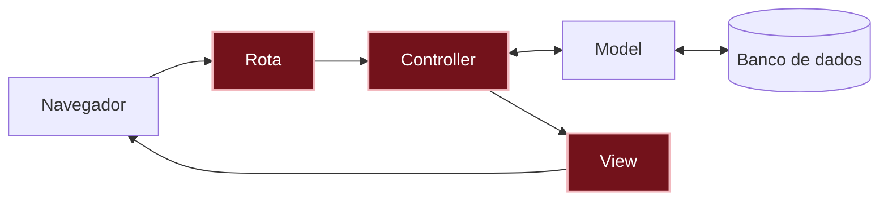

# O que aconteceu?

Por dentro do app

Quando alguém abre o app, a requisição passa por três peças deste capítulo, nesta ordem:

1. A **[rota]({{ site.baseurl }}#rota)**, em `config/routes.rb`, recebe o endereço (`/messages` ou a página principal, `/`) e diz: "isso é com o `MessagesController`, ação `index`".
2. O **[controller]({{ site.baseurl }}#controller)**, em `app/controllers/messages_controller.rb`, pede os recados ao model (`Message.order(created_at: :desc)`) e guarda a lista em `@messages`.
3. A **[view]({{ site.baseurl }}#view)**, em `app/views/messages/index.html.erb`, recebe a `@messages` e monta a página, repetindo o cartão para cada recado.

Você está aqui: este é o caminho que uma requisição percorre dentro do app.

Agora o caminho está completo: a requisição sai do navegador, passa pela rota, pelo controller, pelo model e pelo banco de dados, e volta como uma página montada pela view.

**A assistente, de novo.** No capítulo anterior, o model `Message` era uma assistente especialista que cuida da planilha de recados. Aqui, o controller pediu para ela "todos os recados, dos mais novos para os mais antigos", e ela entregou a lista. Na view, cada `message` da lista é um recado, com todas as informações dele: por isso dá para escrever `message.content` e `message.author`.

**Por que separar a view do model?** O model cuida dos dados e das regras: quais informações um recado tem e como guardar, buscar e apagar. A view cuida só da aparência: como o recado aparece na tela. Mantendo os dois separados:

- **Dá para mudar a aparência sem mexer nos dados.** Trocar o visual dos cartões não muda nada no model nem nos recados guardados.
- **Os mesmos dados servem para telas diferentes.** A lista de recados, a página de um recado só ou até um app de celular podem usar o mesmo model, cada um com a sua view.
- **Cada arquivo fica pequeno e fácil de achar.** Problema de aparência? Olhe a view. Problema com os dados? Olhe o model.

E o controller fica no meio, juntando os dois. Esse jeito de dividir o app em **M**odel, **V**iew e **C**ontroller tem nome: **MVC**. Ele é usado no Rails e em muitos outros frameworks.

**Geradores ajudam, mas você revisa.** O `bin/rails generate controller` criou o controller e a view de uma vez, mas também acrescentou uma rota que a gente não queria, e você apagou. Geradores (e IAs) economizam digitação, mas quem decide o que fica no código é você.

**Os nomes se encaixam.** Você não precisou dizer ao Rails onde está cada arquivo: ele encontra pelos nomes. A rota `messages#index` leva ao `MessagesController`, ação `index`, que mostra a view `app/views/messages/index.html.erb`. É mais uma convenção do Rails.

**Seguir os erros.** Cada erro deste capítulo dizia exatamente o que faltava, na mesma ordem do caminho da requisição: primeiro não havia rota para `/messages`; depois a rota existia, mas o controller não. Quem programa passa muito tempo lendo mensagens de erro, e isso não quer dizer que algo deu errado: quer dizer que o próximo passo está escrito na tela.

Não existem perguntas bobas

Por que a gente apagou a rota que o generate criou?

O gerador não sabe que você já tinha criado a rota no passo 3, então ele acrescentou a dele, `get "messages/index"`. Ela funcionaria, mas deixaria dois endereços para a mesma página, um deles com um nome estranho (`/messages/index`). Ficar com uma rota só, a que você escolheu, deixa o app mais simples.

O que é o @ na frente de @messages?

É o jeito de o controller passar uma informação para a view. Uma variável com `@` no controller pode ser usada na view. Sem o `@`, ela só existiria dentro do controller, e a view não enxergaria.

Por que o controller é MessagesController, no plural, e o model é Message, no singular?

O model representa **um** recado. O controller cuida de **todos** os recados: listar, postar, corrigir e apagar. Por isso, a convenção do Rails é model no singular e controller no plural.

O que é o .html.erb no nome da view?

Quer dizer que o arquivo é uma página HTML (`.html`) com pedaços de Ruby misturados, que o ERB (`.erb`, de *Embedded Ruby*, Ruby embutido) executa antes de mandar a página para o navegador.

O que faz o each?

Repete um trecho de código para cada item de uma lista. Com dois recados, o cartão aparece duas vezes; com dez, dez vezes. Você escreve o cartão uma vez só.

Para onde foi a página de boas-vindas do Rails?

Ela só aparece enquanto o app não tem uma página principal. Quando você criou a rota `root`, o endereço `/` passou a mostrar o mural de recados.

Quebre de propósito

Abra a view `app/views/messages/index.html.erb` e troque `message.content` por `message.texto`. Salve e recarregue a página.

**Dê um palpite:** o que vai acontecer?

Aparece um erro parecido com `undefined method 'texto'`. Leia com calma: o Rails está dizendo que o recado não tem nenhuma informação chamada `texto`. Ele só conhece as colunas que a migration criou: `author` e `content`.

Agora tire o `@` de `@messages` na view (fica só `messages.each`). Salve e recarregue.

Aparece um erro dizendo que `messages` não existe (`undefined local variable or method`). Sem o `@`, a view não enxerga a lista que o controller preparou.

Desfaça as duas mudanças (volte para `message.content` e `@messages`), salve e recarregue: o mural de recados volta a aparecer.

Preciso de IA para este capítulo?

Não. São três arquivos pequenos, e os erros do próprio Rails mostram o caminho.

Onde uma IA pode ajudar, se você quiser: explicar uma mensagem de erro que você não entendeu. Cole a mensagem e peça uma explicação, sem pedir a correção pronta. Veja como em [Usando IA como tutora]({{ site.baseurl }}).

Cuidado: se você pedir para uma IA "fazer a lista de recados", é comum ela sugerir o *scaffold*, um gerador que cria model, controller, views e rotas de uma vez. Neste projeto, a gente usa só geradores pequenos, como o `generate controller`, e revisa cada peça, para ver como elas se ligam.

Não esqueça

- A **rota** liga um endereço ao controller; o `root` define a página principal.
- O **controller** busca os dados com o model e passa para a view com `@`.
- A **view** monta a página: `<%= %>` mostra algo na tela, e `<% %>` só executa.
- O `each` repete um trecho para cada item de uma lista.
- Uma mensagem de erro é uma pista: ela costuma dizer exatamente o que falta.

Quiz

1. Em que ordem a requisição passa pela rota, pela view e pelo controller?
2. Você esqueceu o `@` em `@messages` no controller, mas escreveu certinho na view. O que acontece?
3. Qual é a diferença entre `<%= message.author %>` e `<% message.author %>`?

Ver respostas

1. Rota, depois controller, depois view.
2. A view não recebe a lista, e aparece um erro como `undefined method 'each' for nil`: para a view, `@messages` está vazia.
3. Com o `=`, a autora aparece na página. Sem o `=`, o código é executado, mas nada aparece.

Para saber mais

Guias oficiais do Rails, em inglês:

- [Rails Routing from the Outside In](https://guides.rubyonrails.org/routing.html): tudo sobre rotas.
- [Action Controller Overview](https://guides.rubyonrails.org/action_controller_overview.html): como funcionam os controllers.
- [Layouts and Rendering in Rails](https://guides.rubyonrails.org/layouts_and_rendering.html): como as views são montadas.

## E agora?

O mural de recados já mostra os recados, mas eles ainda só podem ser criados pelo console. Próximo desafio: [Como postar um recado?]({{ site.baseurl }})
