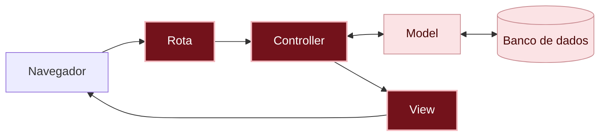

# O que aconteceu?

<details class="passo" markdown="1" open>
<summary>Por dentro do app</summary>

Quando alguém abre o app, a requisição passa por três peças deste capítulo, nesta ordem:

1. A **[rota]({{ site.baseurl }}#rota)**, em `config/routes.rb`, recebe o endereço (`/messages` ou a página principal, `/`) e diz: "isso é com o `MessagesController`, ação `index`".
2. O **[controller]({{ site.baseurl }}#controller)**, em `app/controllers/messages_controller.rb`, pede os recados ao model (`Message.order(created_at: :desc)`) e guarda a lista em `@messages`.
3. A **[view]({{ site.baseurl }}#view)**, em `app/views/messages/index.html.erb`, recebe a `@messages` e monta a página, repetindo o mesmo trecho (a mensagem e a autora) para cada recado.

Você está aqui: este é o caminho que uma requisição percorre dentro do app.



Em vermelho escuro, as peças deste capítulo; em rosa claro, as que você já conhece dos capítulos anteriores.

Agora o caminho está completo: a requisição sai do navegador, passa pela rota, pelo controller, pelo model e pelo banco de dados, e volta como uma página montada pela view.

#### O model, de novo

No capítulo anterior, você viu que o model `Message` cuida dos recados guardados no banco de dados (lembra da comparação com uma assistente que cuida de uma "planilha"?). Aqui, o controller fez um pedido ao model: "todos os recados, dos mais novos para os mais antigos". E o model buscou no banco de dados e entregou a lista. Na view, cada `message` da lista é um recado, com todas as informações dele: por isso dá para escrever `message.content` e `message.author`.

#### Por que separar a view do model?

O model cuida dos dados e das regras: quais informações um recado tem e como guardar, buscar e apagar. A view cuida só da aparência: como o recado aparece na tela. Mantendo os dois separados:

- **Dá para mudar a aparência sem mexer nos dados.** Trocar o visual dos recados não muda nada no model nem nos recados guardados.
- **Os mesmos dados e as mesmas regras servem para telas diferentes.** Uma regra escrita uma vez no model, como "todo recado precisa ter autora", vale para todas as views que mostram ou recebem recados.
- **Cada arquivo fica pequeno e fácil de achar.** Problema de aparência? Olhe a view. Problema com os dados? Olhe o model.

E o controller fica no meio, juntando os dois. Dividir o app assim deixa tudo mais fácil de organizar, e essa divisão não é invenção do Rails: muitos outros [frameworks]({{ site.baseurl }}#framework), em outras linguagens, seguem a mesma ideia. Aprendendo aqui, você vai reconhecer essa organização em outros lugares.

#### Geradores ajudam, mas você revisa

O `bin/rails generate controller` criou o controller e a view de uma vez, mas também acrescentou uma rota que a gente não queria, e você apagou. Geradores (e IAs) economizam digitação, mas quem decide o que fica no código é você.

Tirar o que não faz falta é um hábito de quem programa. Cada linha a mais no código é mais uma coisa para ler, entender e manter funcionando, e um código menor é mais fácil de mudar depois. Essa ideia tem até um nome em inglês: **KISS**, de *keep it simple*, algo como "mantenha simples". No mural de recados, a rota que sobrou não quebrava nada, mas deixava um endereço a mais que ninguém usava.

#### Os nomes se encaixam

Você não precisou dizer ao Rails onde está cada arquivo: ele encontra pelos nomes. A rota `messages#index` leva ao `MessagesController`, ação `index`, que mostra a view `app/views/messages/index.html.erb`. É mais uma convenção do Rails.

#### Seguir os erros

Cada erro deste capítulo dizia exatamente o que faltava, na mesma ordem do caminho da requisição: primeiro não havia rota para `/messages`; depois a rota existia, mas o controller não. Quem programa passa muito tempo lendo mensagens de erro, e isso não quer dizer que algo deu errado: quer dizer que o próximo passo está escrito na tela.

</details>

<details class="passo" markdown="1">
<summary>Não existem perguntas bobas</summary>

<details class="pergunta" markdown="1">
<summary>Por que a gente apagou a rota que o generate criou?</summary>

O gerador não sabe que você já tinha criado a rota no passo 3, então ele acrescentou a dele, `get "messages/index"`. Ela funcionaria, mas deixaria dois endereços para a mesma página, um deles com um nome estranho (`/messages/index`). Ficar com uma rota só, a que você escolheu, deixa o app mais simples.

</details>

<details class="pergunta" markdown="1">
<summary>O que é o @ na frente de @messages?</summary>

É o jeito de o controller passar uma informação para a view. Uma variável com `@` no controller pode ser usada na view. Sem o `@`, ela só existiria dentro do controller, e a view não enxergaria.

</details>

<details class="pergunta" markdown="1">
<summary>Por que o controller é MessagesController, no plural, e o model é Message, no singular?</summary>

O model representa **um** recado. O controller cuida de **todos** os recados: listar, postar, corrigir e apagar. Por isso, a [convenção]({{ site.baseurl }}#convencao) do Rails é model no singular e controller no plural.

E é seguindo essa convenção que o Rails acha tudo sozinho: a rota `messages#index` leva ao `MessagesController`, que fica no arquivo `app/controllers/messages_controller.rb` e mostra as views da pasta `app/views/messages`. Você não precisou dizer onde está cada arquivo. Com um nome diferente, como `MessageController`, o Rails não encontraria o controller, e apareceria um erro.

</details>

<details class="pergunta" markdown="1">
<summary>O que é o .html.erb no nome da view? <span class="label label-purple">Para ir além</span></summary>

Quer dizer que o arquivo é uma página HTML (`.html`) com pedaços de Ruby misturados, que o ERB (`.erb`, de *Embedded Ruby*, Ruby embutido) executa antes de mandar a página para o navegador.

</details>

<details class="pergunta" markdown="1">
<summary>O que faz o each? <span class="label label-purple">Para ir além</span></summary>

Em inglês, *each* quer dizer "cada". Ele repete um trecho de código para cada item de uma lista. Com dois recados, o trecho com a mensagem e a autora aparece duas vezes; com dez, dez vezes. Você escreve esse trecho uma vez só.

</details>

<details class="pergunta" markdown="1">
<summary>Por que ordenar por created_at, e não por updated_at? <span class="label label-purple">Para ir além</span></summary>

As duas colunas guardam datas, mas de momentos diferentes:

- `created_at` é quando o recado foi **criado**, e nunca muda.
- `updated_at` é quando o recado foi **alterado** pela última vez, e muda a cada correção.

Por enquanto, os recados ainda não podem ser corrigidos, então as duas datas são iguais. Mas, no capítulo 05, quando der para corrigir um recado, ordenar por `updated_at` faria um recado antigo pular para o topo só porque alguém corrigiu uma letra, como se fosse novo. Com o `created_at`, cada recado fica no lugar de quando foi postado.

Ordenar por `updated_at` também pode fazer sentido em outros apps, por exemplo para mostrar primeiro o que mudou há pouco. É uma decisão de quem planeja o app.

</details>

<details class="pergunta" markdown="1">
<summary>Para onde foi a página de boas-vindas do Rails? <span class="label label-purple">Para ir além</span></summary>

Ela só aparece enquanto o app não tem uma página principal. Quando você criou a rota `root`, o endereço `/` passou a mostrar o mural de recados.

A página de boas-vindas não foi apagada: ela nem está nos arquivos do seu app. Ela vem de dentro do próprio Rails, que só a mostra quando falta a página principal. Se você apagar a linha do `root`, ela volta a aparecer.

</details>

</details>

<details class="passo" markdown="1">
<summary>Quebre de propósito <span class="label label-blue">Opcional</span></summary>

Este teste precisa de pelo menos um recado no mural de recados. Como você apagou todos no passo 8, crie um pelo console (`bin/rails console`):

```ruby
Message.create(author: "Ana", content: "Oi!")
```

Saia do console com `exit`. Depois, abra a view `app/views/messages/index.html.erb` e troque `message.content` por `message.texto`. Salve e recarregue a página.

**Dê um palpite:** o que vai acontecer?

Aparece a página de erro **NoMethodError in Messages#index**, com uma mensagem parecida com `undefined method 'texto'`. Leia com calma: o Rails está dizendo que o recado não tem nenhuma informação chamada `texto`. Ele só conhece as colunas que a migration criou: `author` e `content`.

Antes de quebrar outra coisa, desfaça essa mudança: volte `message.texto` para `message.content`, salve e recarregue. O recado volta a aparecer.

Agora tire o `@` de `@messages` na view (fica só `messages.each`). Salve e recarregue.

**Dê um palpite:** e agora, o que vai acontecer?

Aparece a página de erro **NameError in Messages#index**, com uma mensagem dizendo que `messages` não existe (`undefined local variable or method`). Sem o `@`, a view não enxerga a lista que o controller preparou.

Desfaça essa mudança também: volte para `@messages`, salve e recarregue. O mural de recados volta a aparecer.

Por último, tire o `=` de `<%= message.content %>` (fica `<% message.content %>`). Salve e recarregue.

**Dê um palpite:** vai aparecer um erro?

Não aparece erro nenhum! A autora continua na página, mas a mensagem some. Sem o `=`, o Ruby ainda lê a mensagem do recado, mas não coloca o resultado na página. Esse tipo de problema é traiçoeiro: nada avisa que tem algo errado, e você só percebe olhando a página com atenção.

Volte o `=` (fica `<%= message.content %>`), salve e recarregue: a mensagem aparece de novo.

</details>

<details class="passo" markdown="1">
<summary>Preciso de IA para este capítulo?</summary>

Não. São três arquivos pequenos, e os erros do próprio Rails mostram o caminho.

Onde uma IA pode ajudar, se você quiser: explicar uma mensagem de erro que você não entendeu. Cole a mensagem e peça uma explicação, sem pedir a correção pronta. Veja como em [Usando IA como tutora]({{ site.baseurl }}).

Cuidado: se você pedir para uma IA "fazer a lista de recados", é comum ela sugerir o *scaffold*, um gerador que cria model, controller, views e rotas de uma vez. Neste projeto, a gente usa só geradores pequenos, como o `generate controller`, e revisa cada peça, para ver como elas se ligam.

</details>

<details class="passo" markdown="1">
<summary>Não esqueça</summary>

- Quando alguém abre o app, a requisição passa pela **rota**, pelo **controller** e pela **view**, nessa ordem.
- A **rota** diz qual controller cuida de cada endereço.
- O **controller** pede os recados ao **model** e entrega para a view.
- A **view** monta a página que aparece no navegador.
- Uma mensagem de erro é uma pista: ela costuma dizer exatamente o que falta.

</details>

<details class="passo" markdown="1">
<summary>Quiz</summary>

1. Quando alguém abre o mural de recados no navegador, por quais peças do app a requisição passa, e em que ordem?
2. Você quer mudar o jeito como os recados aparecem na página. Em qual peça você mexe: na rota, no controller ou na view?
3. Você abriu um endereço novo e apareceu o erro `No route matches`. O que está faltando?

<details markdown="1">
<summary>Ver respostas</summary>

1. Primeiro pela rota, depois pelo controller, que pede os recados ao model (e o model busca no banco de dados), e por último pela view, que monta a página.
2. Na view: é ela que monta a página.
3. A rota: nenhuma rota diz para onde vai esse endereço.

</details>

</details>

<details class="passo" markdown="1">
<summary>Para saber mais</summary>

Guias oficiais do Rails, em inglês:

- [Rails Routing from the Outside In](https://guides.rubyonrails.org/routing.html): tudo sobre rotas.
- [Action Controller Overview](https://guides.rubyonrails.org/action_controller_overview.html): como funcionam os controllers.
- [Layouts and Rendering in Rails](https://guides.rubyonrails.org/layouts_and_rendering.html): como as views são montadas.

</details>

## E agora?

O mural de recados já mostra os recados, mas eles ainda só podem ser criados pelo console. Próximo desafio: [Como postar um recado?]({{ site.baseurl }})
