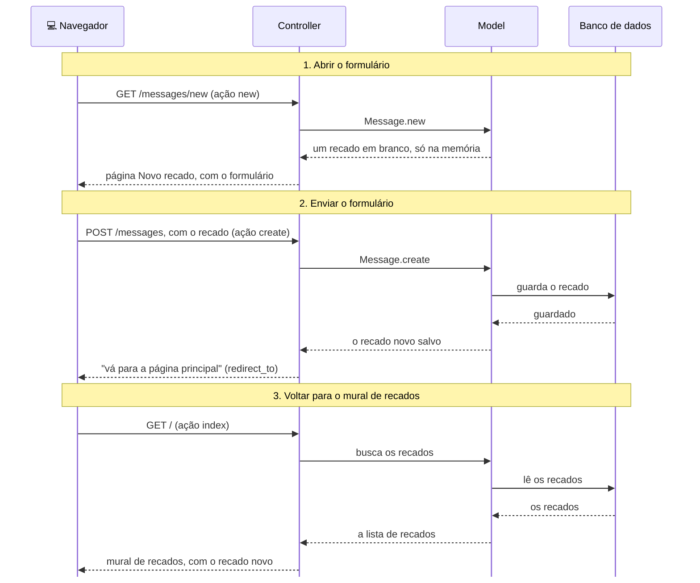

# O que aconteceu?

<details class="passo" markdown="1" open>
<summary>Por dentro do app</summary>

Postar um recado usa **três** requisições, uma depois da outra:

1. **Abrir o formulário.** Quando a pessoa clica em **Novo recado**, o navegador faz uma requisição `GET /messages/new`. A rota manda para a ação `new`, que prepara um recado em branco, e a view `new.html.erb` mostra o formulário.
2. **Enviar o formulário.** Quando a pessoa clica em **Postar recado**, o navegador faz uma requisição `POST /messages`, levando o que foi escrito. A rota manda para a ação `create`, que pede ao model para guardar o recado no banco de dados.
3. **Voltar para o mural de recados.** O `create` não monta nenhuma página: ele responde "vá para a página principal" (`redirect_to root_path`). O navegador faz então uma requisição `GET /`, e a ação `index`, que você criou no capítulo anterior, mostra o mural de recados, já com o recado novo.



Em cada requisição, a rota escolhe a ação do controller, como você viu no capítulo anterior.

#### O formulário e o recado em branco

A view `new.html.erb` monta o formulário a partir do recado em branco que a ação `new` preparou (`@message = Message.new`). É por isso que os campos se chamam `author` e `content`, iguais às colunas da tabela: o formulário sabe quais informações um recado tem.

#### O que viaja do navegador até o controller

Quando o formulário é enviado, o que a pessoa escreveu chega ao controller num pacote chamado `params` (de *parameters*, parâmetros). Você pode ver esse pacote no terminal do servidor, numa linha parecida com esta:

```
Parameters: {"authenticity_token" => "[FILTERED]", "message" => {"author" => "Ana", "content" => "Meu primeiro recado!"}}
```

Repare no `"message" => {...}`: a autora e a mensagem chegam juntas, dentro de um recado (`message`).

#### A lista do que entra

O `message_params` não pega tudo que chegou: ele diz exatamente o que o controller aceita, um recado com `author` e `content`. Se chegar qualquer outra coisa, ela é ignorada. Isso protege o app: alguém poderia mandar um formulário modificado tentando mudar uma informação que não deveria.

#### O resources e a convenção

O `resources :messages` criou as rotas pela [convenção]({{ site.baseurl }}#convencao) do Rails: `GET /messages` vai para o `index`, `GET /messages/new` vai para o `new`, e `POST /messages` vai para o `create`. O `index` e o `create` usam o mesmo endereço; o que muda é o tipo de requisição. Com o `only`, o app só tem as rotas que você usa.

A convenção também dá nome aos endereços: é daí que vem o `new_message_path` do link **Novo recado**. Por isso, o link só funcionou depois que a rota existia.

</details>

<details class="passo" markdown="1">
<summary>Não existem perguntas bobas</summary>

<details class="pergunta" markdown="1">
<summary>Qual é a diferença entre Message.new e Message.create?</summary>

O `Message.new` cria um recado só na memória do app, sem guardar: serve para o formulário saber o que preencher. O `Message.create` cria e já guarda no banco de dados. Se o app fosse desligado, o recado do `new` sumiria, e o do `create` continuaria lá.

</details>

<details class="pergunta" markdown="1">
<summary>Qual é a diferença entre GET e POST?</summary>

O `GET` **pede** uma página, sem mudar nada no app: é o que acontece quando você abre um endereço. O `POST` **envia** informações para o app guardar ou mudar alguma coisa: é o que acontece quando você envia um formulário. Por isso, o mesmo endereço, `/messages`, pode ir para duas ações diferentes.

</details>

<details class="pergunta" markdown="1">
<summary>Por que o create manda o navegador de volta, em vez de mostrar a página direto? <span class="label label-purple">Para ir além</span></summary>

Se o `create` mostrasse o mural de recados direto, a última requisição do navegador continuaria sendo o `POST`. Aí, ao recarregar a página, o navegador enviaria o formulário de novo, e o mesmo recado seria postado duas vezes. Com o `redirect_to`, a última requisição é um `GET`, e recarregar só mostra o mural de recados de novo.

</details>

<details class="pergunta" markdown="1">
<summary>O que é o authenticity_token? <span class="label label-purple">Para ir além</span></summary>

É um código secreto que o `form_with` coloca escondido em todo formulário. Quando o formulário chega, o Rails confere esse código para ter certeza de que o formulário veio do próprio app, e não de outro site tentando enviar recados no seu lugar. No terminal, ele aparece como `[FILTERED]` (escondido), justamente por ser secreto.

</details>

<details class="pergunta" markdown="1">
<summary>Por que existe o private no controller?</summary>

Tudo que vem depois do `private` só pode ser usado pelo próprio controller. Assim, o `message_params` não vira uma ação, e ninguém consegue chamar ele por um endereço. As ações, como `index`, `new` e `create`, ficam sempre antes do `private`.

</details>

</details>

<details class="passo" markdown="1">
<summary>Quebre de propósito <span class="label label-blue">Opcional</span></summary>

No controller, coloque um `#` na frente da linha `@message = Message.new`, para ela virar comentário. Salve e abra a página **Novo recado**.

**Dê um palpite:** o que vai acontecer?

Aparece a página de erro **ArgumentError in Messages#new**, com a mensagem `Passed nil to the :model argument, expect an object or false`. O `form_with` recebeu "nada" (`nil`) no lugar do recado em branco e não sabe montar o formulário.

Tire o `#`, salve e recarregue: o formulário volta.

Agora, coloque um `#` na frente da linha `redirect_to root_path`, na ação `create`. Salve, recarregue a página **Novo recado** e poste um recado.

**Dê um palpite:** o recado vai aparecer?

Parece que nada aconteceu: a página não muda, e o texto continua no formulário. Mas clique em **Voltar**: o recado está lá! Ele foi guardado, só que o `create` não mandou o navegador de volta para o mural de recados. Esse é outro tipo de problema sem mensagem de erro: o app funciona pela metade.

Tire o `#`, salve, e apague o recado de teste pelo console (`Message.last.destroy`).

</details>

<details class="passo" markdown="1">
<summary>Preciso de IA para este capítulo?</summary>

Não. O formulário, a rota e as ações seguem o mesmo caminho dos capítulos anteriores, e os erros mostram cada peça que falta.

Se quiser usar uma IA, use como tutora: peça para ela explicar, e faça você cada passo. Por exemplo:

> Qual é a diferença entre uma requisição GET e uma POST? Me explique com um exemplo do dia a dia, sem me dar código.
{: .pedido-ia }

Veja como começar a conversa em [Usando IA como tutora]({{ site.baseurl }}).

<details class="pergunta" markdown="1">
<summary>E se eu pedisse o código para a IA? <span class="label label-purple">Para ir além</span></summary>

Se você pedir para uma IA "fazer um formulário para postar recados", é comum ela sugerir o *scaffold*, que cria de uma vez todas as páginas e ações, inclusive as que o plano não pede. Por isso, o pedido funciona melhor com o plano:

> No meu app Rails, o model `Message` tem `author` e `content`. Quero uma página "Novo recado" (a ação `new`), com os campos "Seu nome" e "Recado" e o botão "Postar recado", e um link "Novo recado" na página da lista. Depois de postar, volta para a lista. Sem scaffold, e só com as rotas necessárias.
{: .pedido-ia }

Confira o resultado contra o plano:

- Tem só o que o plano pede: a página Novo recado e o link na lista, sem páginas a mais?
- O controller usa uma lista do que aceita (como o `message_params`), e não `params` direto?
- A rota tem `only`, só com as ações que você usa?

Veja mais dicas em [Como pedir código para uma IA]({{ site.baseurl }}), nos Extras.

</details>
</details>

<details class="passo" markdown="1">
<summary>Não esqueça</summary>

- A ação `new` prepara um recado em branco, e a view `new.html.erb` mostra o formulário.
- Um formulário envia o que a pessoa escreveu com uma requisição `POST`.
- A ação `create` recebe o formulário, pede ao model para guardar o recado e manda o navegador de volta para o mural de recados.
- O controller só aceita do formulário o que está na lista do `message_params`.
- O `resources` cria as rotas pela convenção do Rails, e o `only` escolhe quais.

</details>

<details class="passo" markdown="1">
<summary>Quiz</summary>

1. Quando a pessoa clica em **Postar recado**, que tipo de requisição o navegador faz, e para qual ação ela vai?
2. Você criou a rota do `create`, mas esqueceu de escrever a ação no controller. Onde o erro aparece, e o que ele diz?
3. Por que o link **Novo recado** deu erro antes de você criar a rota?
4. Depois que o recado é guardado, por que a pessoa volta a ver o mural de recados?

<details markdown="1">
<summary>Ver respostas</summary>

1. Uma requisição `POST /messages`, que vai para a ação `create`.
2. Na tela, nada acontece. No terminal do servidor, aparece `The action 'create' could not be found for MessagesController`.
3. Porque o `new_message_path` é um nome que o Rails cria a partir das rotas. Sem a rota do `new`, esse nome não existia, e apareceu o **NameError**.
4. Porque a ação `create` termina com `redirect_to root_path`, que manda o navegador de volta para a página principal.

</details>

</details>

<details class="passo" markdown="1">
<summary>Para saber mais</summary>

Guias oficiais do Rails, em inglês:

- [Action View Form Helpers](https://guides.rubyonrails.org/form_helpers.html): tudo sobre o `form_with` e os campos de formulário.
- [CRUD, Verbs, and Actions](https://guides.rubyonrails.org/routing.html#crud-verbs-and-actions): como o `resources` liga verbos, endereços e ações.
- [Strong Parameters](https://guides.rubyonrails.org/action_controller_overview.html#strong-parameters): a lista do que o controller aceita.

</details>

## E agora?

Agora qualquer pessoa pode postar um recado. Mas, se ela escrever algo errado, não tem como corrigir. Próximo desafio: [Errei! Como corrigir ou apagar?]({{ site.baseurl }})
