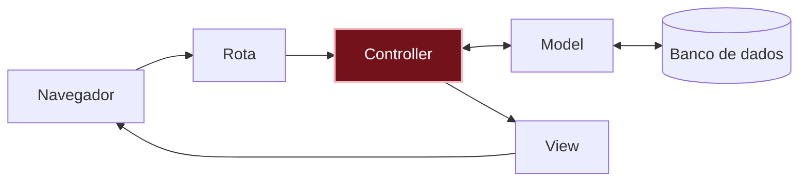

# O que aconteceu?

Por dentro do app

TODO: explicação do conceito, sem jargão desnecessário; o termo técnico aparece aqui (e linka o glossário).

Você está aqui: este é o caminho que uma requisição percorre dentro do app.

Não existem perguntas bobas

TODO: 2–3 perguntas e respostas curtas.

TODO: cada pergunta num bloco `
`.

Quebre de propósito

TODO (opcional): uma mudança que causa erro de propósito e como ler a mensagem.

Preciso de IA para este capítulo?

TODO (opcional): transformar o plano do "Pense antes" num pedido para a IA e conferir o resultado contra as regras do plano.

Não esqueça

TODO: 3–5 bullets.

Quiz

TODO: 2–3 perguntas.

Ver respostas

TODO

Para saber mais

TODO (opcional): links e vídeos para quem quiser ir além.

## E agora?

Próximo desafio: [Errei! Como corrigir ou apagar?]({{ site.baseurl }})
