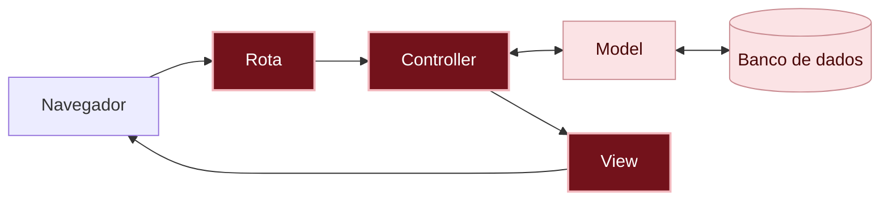

# O que aconteceu?

Por dentro do app

**O número de cada recado.** Para corrigir ou apagar, o app precisa saber **qual** recado. Por isso o `id` vai no endereço: em `/messages/3/edit`, o `3` é o recado. Na ação, o `params[:id]` pega esse número, e o `Message.find` pede ao model o recado com ele.

**Corrigir tem duas ações.** Uma **mostra** o formulário e a outra **guarda** o que veio dele:

1. `edit` busca o recado e mostra o formulário já preenchido.
2. `update` recebe o formulário, troca o que mudou e guarda no banco de dados.

Postar, no capítulo 04, tem a mesma ideia: o `new` mostra o formulário vazio, e o `create` guarda o recado novo. São dois pares que andam juntos: `new` e `create`, `edit` e `update`.

**Cada requisição tem um tipo.** O navegador não manda só o endereço: ele diz também **o que quer fazer** com ele. Esse tipo de requisição se chama **verbo HTTP**:

| O que a pessoa faz | Verbo | Endereço | Ação |
|---|---|---|---|
| Vê o mural de recados | `GET` (pegar) | `/` ou `/messages` | `index` |
| Abre a página do recado novo | `GET` (pegar) | `/messages/new` | `new` |
| Posta um recado | `POST` (enviar) | `/messages` | `create` |
| Abre a correção | `GET` (pegar) | `/messages/3/edit` | `edit` |
| Salva a correção | `PATCH` (atualizar) | `/messages/3` | `update` |
| Apaga um recado | `DELETE` (apagar) | `/messages/3` | `destroy` |

Repare: salvar e apagar usam o **mesmo endereço**, `/messages/3`. O que muda é o verbo. É assim que a rota sabe para qual ação mandar.

Você está aqui: este é o caminho que uma requisição percorre dentro do app.

Em vermelho escuro, as peças deste capítulo; em rosa claro, as que você já conhece dos capítulos anteriores.

**O model, de novo.** O model `Message` continua cuidando dos recados guardados no banco de dados (a assistente da "planilha", lembra?). Neste capítulo, o controller pediu ao model: "me traga o recado número 3" (`find`), "troque o que está escrito nele" (`update`) e "apague esse recado do banco de dados" (`destroy`).

**O CRUD está completo.** Com este capítulo, o mural de recados faz as quatro ações do [CRUD]({{ site.baseurl }}#crud): criar (postar), ler (ver), atualizar (corrigir) e apagar. Quase todo sistema que guarda informações faz essas quatro coisas, e agora você sabe como elas funcionam por dentro.

Não existem perguntas bobas

Por que o número do recado aparece no endereço?

Porque cada requisição chega sozinha ao app: quando você clica em **Salvar**, o app não lembra qual recado você abriu antes. O número no endereço diz, a cada requisição, de qual recado se trata.

Quando um recado é apagado, o número dele volta a ser usado?

Não. Se o recado 3 for apagado, o próximo recado vai ser o 4, 5 ou o que vier depois, nunca o 3 de novo. Assim, um link antigo para `/messages/3/edit` nunca abre o recado de outra pessoa por engano: ele dá o erro `Couldn't find Message`.

Por que o recado do edit tem @ e o do destroy não tem?

O `@` serve para passar uma informação do controller para a view. O `edit` mostra uma view com o formulário, então precisa do `@message`. O `destroy` não mostra view nenhuma: ele apaga o recado e manda o navegador de volta para a página principal.

O `update` também usa `@message`. Por enquanto, não faria diferença, mas no capítulo 07 ele vai precisar mostrar o formulário de novo quando o recado vier vazio.

Por que Editar é um link e Apagar é um botão?

O **Editar** só abre uma página, sem mudar nada: um link (`GET`) basta. O **Apagar** muda o banco de dados, e mudanças são feitas com formulários e botões (`DELETE`). Assim, um programa que visita os links de uma página, como um buscador, nunca apaga nada sem querer.

E se eu tirar o only da rota?

Sem o `only`, o `resources :messages` cria as rotas das sete ações do Rails, incluindo uma que o mural de recados não usa: `show`, a página de um recado só. Veja a lista no [glossário]({{ site.baseurl }}#acao). Com o `only`, o app só tem as rotas que você precisa.

Eu copiei o formulário. Tem jeito de não repetir? Para ir além

Tem: o Rails permite separar um pedaço de view num arquivo próprio, chamado *partial*, e usar esse pedaço em várias views. O `new.html.erb` e o `edit.html.erb` são um ótimo exemplo: os dois têm o mesmo formulário, e só mudam o título e o botão. A gente preferiu copiar para deixar cada view completa e fácil de ler. No capítulo [E se alguém mandar um recado vazio?]({{ site.baseurl }}), o passo 9 mostra como juntar os dois formulários numa partial. Para saber mais, veja *partials* no guia [Layouts and Rendering in Rails](https://guides.rubyonrails.org/layouts_and_rendering.html#using-partials), em inglês.

Quebre de propósito Opcional

Clique em **Editar** num recado. Na barra de endereço, troque o número do recado por `999` (ou outro número que não seja de nenhum recado), para o endereço terminar com `/messages/999/edit`, e aperte **Enter**.

**Dê um palpite:** o que vai acontecer?

Aparece a página **ActiveRecord::RecordNotFound**, com a mensagem `Couldn't find Message with 'id'="999"`. A rota e a ação existem, mas o model não encontrou nenhum recado com esse número.

Agora tire o `:destroy` da lista do `only`, em `config/routes.rb`, salve e recarregue a página principal. O botão **Apagar** continua lá.

**Dê um palpite:** clique em **Apagar** num recado e depois em **OK**. O que acontece?

Na tela, nada acontece: o recado continua lá. No terminal do servidor, aparece `No route matches [DELETE] "/messages/3"`. O botão existe e manda a requisição, mas nenhuma rota recebe o verbo `DELETE` para esse endereço. Repare: o endereço `/messages/3` ainda existe, para o `PATCH` do `update`. O que falta é a rota para **apagar**.

Coloque o `:destroy` de volta, salve e recarregue: o mural de recados volta ao normal.

Preciso de IA para este capítulo?

Não. Você repetiu o mesmo caminho do capítulo 04, link, rota, controller e view, e os erros mostraram cada peça que faltava.

Se quiser usar uma IA, use como tutora: peça para ela explicar, e faça você cada passo. Por exemplo:

> Por que, no Rails, apagar alguma coisa é feito com um botão, e não com um link? Me explique sem me dar código.
{: .pedido-ia }

Veja como começar a conversa em [Usando IA como tutora]({{ site.baseurl }}).

E se eu pedisse o código para a IA? Para ir além

Se você pedir para uma IA "fazer o editar e o apagar", é bem provável que ela sugira o *scaffold*, ou que crie as sete ações de uma vez, incluindo páginas que o mural de recados não usa. Por isso, o pedido funciona melhor com o seu plano:

> No meu app Rails, o model `Message` tem `author` e `content`. Quero um link **Editar** em cada cartão, que abre uma página com o formulário preenchido, e um botão **Apagar** que pergunta "Quer mesmo apagar este recado?" antes de apagar. Sem scaffold, e só com as rotas necessárias.
{: .pedido-ia }

Mesmo com um bom pedido, confira o resultado contra o plano:

- A rota tem `only`, só com as ações que você usa?
- O **Apagar** pergunta antes de apagar?
- O controller usa `message_params`, e não `params` direto?

Veja mais dicas em [Como pedir código para uma IA]({{ site.baseurl }}), nos Extras.

Não esqueça

- Cada recado tem um `id`, um número só dele. O endereço leva esse número, e o `params[:id]` pega ele na ação.
- `Message.find` busca um recado pelo número; `update` muda e guarda; `destroy` apaga.
- Corrigir tem duas ações: `edit` mostra o formulário e `update` guarda.
- O verbo da requisição (`GET`, `POST`, `PATCH`, `DELETE`) diz o que o navegador quer fazer com o endereço.
- Tudo que apaga para sempre merece uma pergunta antes.

Quiz

1. Em `/messages/7/edit`, qual é o valor de `params[:id]`?
2. Salvar a correção e apagar usam o mesmo endereço, `/messages/7`. Como a rota sabe para qual ação mandar?
3. Você criou a ação `edit`, mas esqueceu de criar a view. Qual erro aparece?

Ver respostas

1. `7`.
2. Pelo verbo da requisição: `PATCH` vai para o `update`, e `DELETE` vai para o `destroy`.
3. A página **No view template for interactive request**, dizendo que falta o arquivo `app/views/messages/edit.html.erb`.

Para saber mais

Guias oficiais do Rails, em inglês:

- [CRUD, Verbs, and Actions](https://guides.rubyonrails.org/routing.html#crud-verbs-and-actions): como o `resources` liga verbos, endereços e ações.
- [Action View Form Helpers](https://guides.rubyonrails.org/form_helpers.html): tudo sobre o `form_with` e os campos de formulário.

## E agora?

O mural de recados já faz tudo que o plano pede, mas os cartões ainda são só texto, um embaixo do outro. Próximo desafio: [Como deixar o mural de recados mais bonito?]({{ site.baseurl }})
