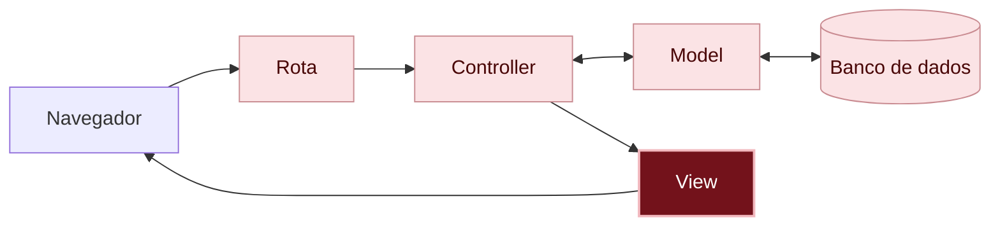

# O que aconteceu?

<details class="passo" markdown="1" open>
<summary>Por dentro do app</summary>

Neste capítulo, só a aparência mudou. Você mexeu em três arquivos, todos de view:

1. O **layout**, `app/views/layouts/application.html.erb`, que é a moldura de todas as páginas: ele passou a trazer o Bulma.
2. As views do app: a do mural de recados, `index.html.erb`, e as dos formulários, `new.html.erb` e `edit.html.erb`. Elas ganharam classes, que dizem ao Bulma o que é cada parte da página.

Você está aqui: este é o caminho que uma requisição percorre dentro do app.



Em vermelho escuro, as peças deste capítulo; em rosa claro, as que você já conhece dos capítulos anteriores.

#### Estilos prontos

O **Bulma** é uma biblioteca de [CSS]({{ site.baseurl }}#css): um conjunto de estilos que outra pessoa já escreveu e deixou pronto para usar. Você não escreveu nenhum estilo: só deu nomes às partes da página, com as classes, e o Bulma já sabia como mostrar um `button`, um `card` ou uma `box`.

#### O layout, a moldura de todas as páginas

Cada view monta só o miolo da página. O resto, como o título da aba e os estilos, vem do layout, que envolve todas as views. Por isso bastou uma linha no layout para o Bulma valer no app inteiro.

#### A separação valeu a pena

No [capítulo 03]({{ site.baseurl }}), você viu que a view e o model ficam separados. Neste capítulo, você trocou toda a aparência dos recados sem mexer no model, no controller nem em nenhum recado guardado.

</details>

<details class="passo" markdown="1">
<summary>Não existem perguntas bobas</summary>

<details class="pergunta" markdown="1">
<summary>Preciso decorar as classes do Bulma?</summary>

Não. Ninguém decora: quem programa consulta a [documentação do Bulma](https://bulma.io/documentation/), em inglês, sempre que precisa. Lá tem exemplos de cada parte, como botões, cartões e formulários, prontos para copiar.

</details>

<details class="pergunta" markdown="1">
<summary>Todo app busca o CSS na internet, como o Bulma aqui? <span class="label label-purple">Para ir além</span></summary>

Não. Buscar o CSS em outro site, pela linha do `<link>`, é o jeito mais rápido de começar: uma linha só, sem instalar nada. Por isso o guia usa. Mas esse jeito depende da internet e de outro site estar no ar. É também por isso que o endereço tem a versão do Bulma (`bulma@1.0.4`): assim, o visual do app não muda sozinho quando sair uma versão nova.

Em apps de verdade, o mais comum é o CSS ficar **dentro do próprio app**, junto com o resto do código, na pasta `app/assets/stylesheets`. O Rails já criou um arquivo lá, o `application.css`, que você vai usar no desafio [Cores nos recados]({{ site.baseurl }}). Esse CSS pode ser escrito à mão, vir de uma biblioteca guardada no projeto ou ser montado por uma ferramenta, como o Tailwind. Assim, o app funciona igual em qualquer lugar, e quem programa decide quando atualizar.

</details>

<details class="pergunta" markdown="1">
<summary>Usar uma biblioteca pronta não é trapaça?</summary>

Não. Quase todo app usa código que outras pessoas escreveram, e o próprio Rails é um exemplo disso. Escolher uma boa ferramenta e saber usar é parte do trabalho de quem programa. Aprender a escrever CSS do zero continua útil, e você pode fazer isso com calma depois do workshop.

</details>

<details class="pergunta" markdown="1">
<summary>Dá para mudar as cores e o jeito dos botões? <span class="label label-purple">Para ir além</span></summary>

Dá. Troque o `is-primary` do botão **Postar recado** por `is-link`, `is-info`, `is-success` ou `is-warning`, salve e recarregue para ver a diferença. A documentação do Bulma mostra todas as opções na página de [botões](https://bulma.io/documentation/elements/button/).

</details>

<details class="pergunta" markdown="1">
<summary>O Bulma vem da internet? <span class="label label-purple">Para ir além</span></summary>

Vem. A linha do `<link>` busca os estilos do Bulma num site na internet, e é por isso que você não precisou instalar nada. Sem internet, o app continua funcionando, mas fica sem os estilos.

</details>

</details>

<details class="passo" markdown="1">
<summary>Quebre de propósito <span class="label label-blue">Opcional</span></summary>

No `app/views/layouts/application.html.erb`, coloque `<!--` antes e `-->` depois da linha do Bulma, para ela virar um comentário:

```erb
    <!-- <link rel="stylesheet" href="https://cdn.jsdelivr.net/npm/bulma@1.0.4/css/bulma.min.css"> -->
```

Salve e recarregue a página.

**Dê um palpite:** o que acontece com o mural de recados?

Ele volta a ser só texto, um recado embaixo do outro. Nenhum erro aparece: as classes continuam lá, mas ninguém diz ao navegador o que fazer com elas.

Tire o `<!--` e o `-->`, salve e recarregue: o mural de recados volta a ficar bonito.

</details>

<details class="passo" markdown="1">
<summary>Preciso de IA para este capítulo?</summary>

Não. O Bulma já traz as classes prontas, e a [documentação do Bulma](https://bulma.io/documentation/) mostra o que cada uma faz.

Se quiser usar uma IA, use como tutora: peça para ela explicar, e faça você cada passo. Por exemplo:

> No Bulma, o que fazem as classes `columns` e `column`? Me explique com um exemplo, sem mudar o meu código.

Veja como começar a conversa em [Usando IA como tutora]({{ site.baseurl }}).

<details class="pergunta" markdown="1">
<summary>E se eu pedisse o código para a IA? <span class="label label-purple">Para ir além</span></summary>

Para deixar o visual do seu jeito, uma IA pode ajudar a achar as classes certas. O pedido funciona melhor com o seu plano:

> No meu app Rails, já uso o Bulma 1.0, com uma linha `<link>` no layout. Cada recado aparece num `card` dentro de `columns is-multiline`. Como eu deixo o título do mural de recados maior e com uma cor diferente, usando só classes do Bulma?

Confira o resultado:

- Ele usa classes do Bulma, ou sugeriu outra biblioteca, como Bootstrap ou Tailwind? Elas têm nomes de classes diferentes e não funcionam juntas com o Bulma.
- Ele pediu para instalar alguma coisa? Com a linha do `<link>`, não precisa.
- As classes que ele sugeriu existem na [documentação do Bulma](https://bulma.io/documentation/)?

Veja mais dicas em [Como pedir código para uma IA]({{ site.baseurl }}), nos Extras.

</details>
</details>

<details class="passo" markdown="1">
<summary>Não esqueça</summary>

- O Bulma é um conjunto de estilos prontos: você dá nomes às partes da página, com classes, e ele cuida da aparência.
- O layout é a moldura de todas as páginas: o que entra nele vale para o app inteiro.
- Neste capítulo, só a view mudou. Nenhum recado guardado mudou.

</details>

<details class="passo" markdown="1">
<summary>Quiz</summary>

1. Você quer que o botão **Postar recado** fique azul. Em qual arquivo você mexe?
2. Por que bastou uma linha no layout para o Bulma valer também nas páginas Novo recado e Corrigir recado?
3. Neste capítulo, algum recado guardado no banco de dados mudou?

<details markdown="1">
<summary>Ver respostas</summary>

1. No `app/views/messages/new.html.erb`, trocando a classe do botão, por exemplo de `is-primary` para `is-link`.
2. Porque o layout envolve todas as views do app.
3. Não. Só a aparência mudou.

</details>

</details>

<details class="passo" markdown="1">
<summary>Para saber mais</summary>

- [Documentação do Bulma](https://bulma.io/documentation/), em inglês: todas as classes, com exemplos.
- [CSS](https://developer.mozilla.org/pt-BR/docs/Web/CSS), na MDN: para quem quiser aprender a escrever estilos do zero.

</details>

## E agora?

O mural de recados está bonito, mas ainda aceita qualquer coisa: até um recado sem mensagem. Próximo desafio: [E se alguém mandar um recado vazio?]({{ site.baseurl }})

Terminou antes e quer mais? No desafio extra [Cores nos recados]({{ site.baseurl }}), cada pessoa escolhe a cor do seu post-it.
