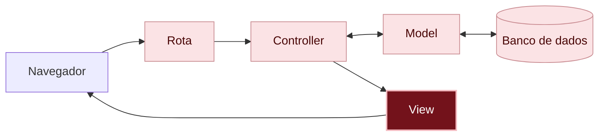

# O que aconteceu?

<details class="passo" markdown="1" open>
<summary>Por dentro do app</summary>

Neste capítulo, só a aparência mudou. Você mexeu em dois arquivos:

1. A **view**, `app/views/messages/index.html.erb`, ganhou classes que dizem o que é cada parte da página: o mural de recados, o cartão, a autora e as ações.
2. O **CSS**, `app/assets/stylesheets/application.css`, usou essas classes para dizer como cada parte aparece: a cor, a sombra, a grade.

Você está aqui: este é o caminho que uma requisição percorre dentro do app.



Em vermelho escuro, as peças deste capítulo; em rosa claro, as que você já conhece dos capítulos anteriores.

#### HTML diz o que é; CSS diz como aparece

A view monta a página em [HTML]({{ site.baseurl }}#html), e as classes dizem o que é cada parte. O [CSS]({{ site.baseurl }}#css) usa essas classes para dizer como cada parte aparece. Por isso, no passo 2, nada mudou na tela: os nomes estavam lá, mas ninguém tinha dito o que fazer com eles.

#### Um arquivo de estilo para o app todo

O `application.css` vale para todas as páginas do app. Por isso, a página de correção também ficou com o fundo cor de papel e o formulário arrumado, sem você mexer na view dela.

#### A separação valeu a pena

No [capítulo 03]({{ site.baseurl }}), você viu que a view e o model ficam separados. Neste capítulo, você trocou toda a aparência dos recados sem mexer no model, no controller nem em nenhum recado guardado.

</details>

<details class="passo" markdown="1">
<summary>Não existem perguntas bobas</summary>

<details class="pergunta" markdown="1">
<summary>O que é o #fff3a3?</summary>

É um jeito de escrever cores no CSS, chamado **hexadecimal**. Os seis caracteres dizem quanto de vermelho, verde e azul a cor tem, de `00` (nada) a `ff` (o máximo). `#ffffff` é branco, `#000000` é preto. Ninguém decora: quem programa escolhe a cor num seletor de cores e copia o código.

</details>

<details class="pergunta" markdown="1">
<summary>Por que o nome da classe é em inglês?</summary>

Pelo mesmo motivo dos outros nomes do código: é o costume de quem programa, e deixa o seu código parecido com os exemplos que você vai encontrar. O que aparece na tela continua em português.

</details>

<details class="pergunta" markdown="1">
<summary>Dá para deixar mais bonito? <span class="label label-purple">Para ir além</span></summary>

Dá, e o CSS tem muitas outras propriedades. Por exemplo, para girar os cartões um pouquinho, como post-its colados de qualquer jeito, acrescente no fim do `application.css`:

```css
.card:nth-child(odd) {
  rotate: -1deg;
}

.card:nth-child(even) {
  rotate: 1deg;
}
```

O `nth-child(odd)` escolhe os cartões ímpares, e o `nth-child(even)`, os pares. Teste, mude os números e veja o que acontece.

</details>

</details>

<details class="passo" markdown="1">
<summary>Quebre de propósito <span class="label label-blue">Opcional</span></summary>

No `application.css`, troque `.card` por `.cartao`. Salve e recarregue a página.

**Dê um palpite:** o que acontece com os cartões?

Eles perdem o fundo amarelo, a sombra e o espaço por dentro. Nenhum erro aparece. O CSS procura partes com a classe `cartao`, e nenhuma tem esse nome: os cartões têm a classe `card`.

Repare: um erro de CSS não mostra mensagem nenhuma, ele só faz a página ficar diferente do esperado. Para descobrir, você compara o nome na view com o nome no CSS. Clicar com o botão direito e escolher **Inspecionar** ajuda.

Volte para `.card`, salve e recarregue: os cartões voltam.

</details>

<details class="passo" markdown="1">
<summary>Preciso de IA para este capítulo?</summary>

Para o CSS, uma IA pode ajudar bastante: existem muitas propriedades, e é fácil esquecer o nome de cada uma. Mas, de novo, o pedido funciona melhor com o seu plano:

> No meu app Rails, cada recado aparece numa `div` com a classe `card`, dentro de uma `div` com a classe `mural`. Escreva CSS puro, sem nenhuma biblioteca, para os cartões parecerem post-its amarelos, lado a lado em grade, com um por linha no celular.

Confira o resultado:

- Ele usa as **suas** classes, ou inventou outras? Se inventou, você vai ter que mudar a view também.
- É CSS puro, ou ele sugeriu instalar alguma coisa, como Bootstrap ou Tailwind? Isso pode ficar para depois.
- Diminua a janela: os cartões descem para a linha de baixo?
- O texto fica fácil de ler em cima do fundo do cartão?

</details>

<details class="passo" markdown="1">
<summary>Não esqueça</summary>

- A view diz o que é cada parte da página, com classes; o CSS diz como cada parte aparece.
- No CSS, o nome da classe começa com ponto: `.card`.
- O `application.css` vale para todas as páginas do app.
- Um erro de CSS não mostra mensagem: compare os nomes na view e no CSS.

</details>

<details class="passo" markdown="1">
<summary>Quiz</summary>

1. Você quer que a autora apareça em negrito, e não em itálico. Em qual arquivo você mexe?
2. Na view, um cartão tem `class="card"`, mas no CSS está escrito `.cards`. O que acontece?
3. Neste capítulo, algum recado guardado no banco de dados mudou?

<details markdown="1">
<summary>Ver respostas</summary>

1. No `application.css`, no bloco `.author`.
2. O cartão fica sem o estilo, e nenhum erro aparece: os nomes precisam ser iguais.
3. Não. Só a aparência mudou: a view e o CSS.

</details>

</details>

<details class="passo" markdown="1">
<summary>Para saber mais</summary>

Em inglês, na MDN, um dos melhores sites sobre a web:

- [CSS](https://developer.mozilla.org/en-US/docs/Web/CSS): a referência de todas as propriedades.
- [CSS grid layout](https://developer.mozilla.org/en-US/docs/Web/CSS/CSS_grid_layout): como funciona a grade.

</details>

## E agora?

O mural de recados já tem cara de mural, mas todos os post-its são da mesma cor. Próximo desafio: [Como escolher a cor do recado?]({{ site.baseurl }})
