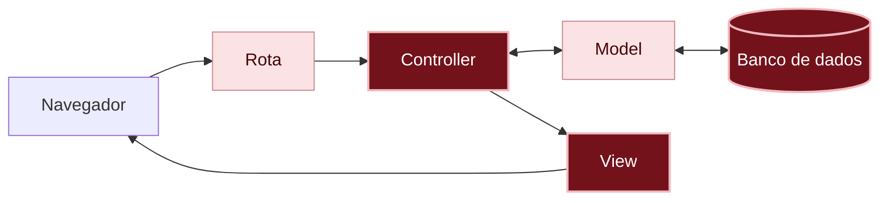

# O que aconteceu?

Por dentro do app

A cor passou por quase todas as peças do app. Siga o caminho dela:

1. A **migration** acrescentou a coluna `color` à tabela de recados, com `yellow` como valor padrão.
2. O **formulário**, na view, ganhou a caixa de escolha da cor.
3. O **controller** passou a aceitar a `color` no `message_params`.
4. O **model** guardou a cor no banco de dados, junto com a autora e a mensagem.
5. A **view** usou a cor para dar uma classe a cada cartão, e o **CSS** pintou o cartão.

Você está aqui: este é o caminho que uma requisição percorre dentro do app.

Em vermelho escuro, as peças deste capítulo; em rosa claro, as que você já conhece dos capítulos anteriores.

#### Uma migration nova, e não a antiga editada

A migration do capítulo 02 já foi aplicada: a tabela já existe. Para mudar a tabela, a gente cria outra migration, que diz só o que mudou. As migrations ficam guardadas em ordem, como um histórico de tudo que aconteceu com o banco de dados.

#### A lista do que entra

O `message_params` é uma lista de permissão: o controller só deixa passar para o model as informações que estão nela. A cor chegou no app, mas foi ignorada até entrar na lista. Parece trabalho a mais, mas é uma proteção: se um dia o recado tiver uma coluna que ninguém deveria mudar pelo formulário, como o número de curtidas, alguém mal-intencionado não consegue mudar essa coluna mandando um formulário modificado.

#### A cor vira uma classe

A view usa o valor guardado para montar o nome da classe de cada cartão (`card-pink`), e o CSS dá a cor de fundo para cada classe. Assim, a informação guardada no banco de dados aparece na tela sem você escrever um `if` para cada cor.

Não existem perguntas bobas

Por que guardar "pink" e não "Rosa"?

O valor guardado é usado pelo código: ele vira o nome da classe, `card-pink`. Nomes de código ficam em inglês, sem acento e sem espaço. O texto que a pessoa vê, **Rosa**, fica só na tela. Se um dia o app for traduzido, o texto muda e o valor guardado continua o mesmo.

Por que não editar a migration do capítulo 02?

Porque ela já foi aplicada: o Rails anota quais migrations já rodou e não roda de novo. Editar uma migration antiga não muda a tabela. Além disso, se outra pessoa já tivesse baixado o código, o banco de dados dela e o seu ficariam diferentes.

Por que um cartão tem duas classes?

Cada classe cuida de uma coisa. A `card` dá o que todo cartão tem igual, desde o capítulo anterior: o espaço por dentro, os cantos, a sombra e o fundo amarelo. A `card-pink` muda só a cor de fundo. Assim, o jeito de um cartão é escrito uma vez só, e cada cor é uma linha.

E se alguém mandar uma cor que não está na lista?

Hoje, o app guardaria, e o cartão ficaria amarelo, porque não existe CSS para ela. A caixa de escolha só mostra as quatro cores, mas alguém poderia mandar um formulário modificado. Recusar valores que não fazem sentido é o assunto do [próximo capítulo]({{ site.baseurl }}).

Quebre de propósito Opcional

No `application.css`, troque `.card-pink` por `.card-rosa`. Salve e recarregue a página.

**Dê um palpite:** o que acontece com o cartão da Duda?

Ele volta a ficar amarelo: continua com tudo que o `.card` dá, mas perde o rosa. Nenhum erro aparece. O CSS procura uma parte com a classe `card-rosa`, e nenhuma tem esse nome: o cartão da Duda tem a classe `card-pink`.

Repare: um erro de CSS não mostra mensagem nenhuma, ele só faz a página ficar diferente do esperado. Para descobrir, você compara o nome na view com o nome no CSS. Clicar com o botão direito e escolher **Inspecionar** ajuda.

Volte para `.card-pink`, salve e recarregue: o cartão fica rosa de novo.

Preciso de IA para este capítulo?

Para a cor, não: a migration, o formulário e o `message_params` seguem o que você já fez nos capítulos anteriores.

Para as cores, uma IA pode ajudar a escolher tons que combinem e que deixem o texto fácil de ler. O pedido funciona melhor com o seu plano:

> No meu app Rails, cada recado aparece numa `div` com as classes `card` e `card-yellow`, `card-pink`, `card-blue` ou `card-green`. Sugira cores de fundo claras para essas quatro classes, em CSS puro, que deixem o texto preto fácil de ler.

Confira o resultado:

- Ele usa as **suas** classes, ou inventou outras? Se inventou, você vai ter que mudar a view também.
- É CSS puro, ou ele sugeriu instalar alguma coisa, como Bootstrap ou Tailwind? Isso pode ficar para depois.
- O texto fica fácil de ler em todas as cores?

Não esqueça

- Para mudar uma tabela que já existe, crie uma migration nova, como a `add_column`. Não edite as antigas.
- O `default` dá um valor para os recados antigos e para os novos que não disserem nada.
- O `message_params` é a lista do que o controller aceita do formulário: uma coluna nova precisa entrar nela.
- A view pode usar um valor guardado para montar uma classe, como `card-<%= message.color %>`.

Quiz

1. Você escolheu **Verde** no formulário, mas o recado foi guardado com `yellow`. Qual é o primeiro lugar para olhar?
2. Na view, um cartão tem `class="card card-blue"`. Quais blocos do CSS valem para ele?
3. Por que os recados que já existiam ficaram amarelos?

Ver respostas

1. O `message_params`, no controller: confira se a `:color` está na lista.
2. O `.card` e o `.card-blue`.
3. Por causa do `default: "yellow"` na migration: quem não tinha cor ganhou o valor padrão.

Para saber mais

Em inglês:

- [Active Record Migrations](https://guides.rubyonrails.org/active_record_migrations.html): tudo sobre migrations, incluindo como mudar tabelas que já existem.
- [Strong Parameters](https://guides.rubyonrails.org/action_controller_overview.html#strong-parameters): a lista do que o controller aceita.

## E agora?

O mural de recados está colorido, mas ainda aceita qualquer coisa: até um recado sem mensagem. Próximo desafio: [E se alguém mandar um recado vazio?]({{ site.baseurl }})
