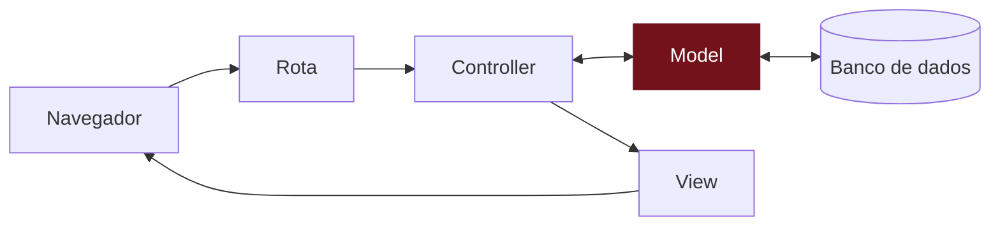

# E se alguém mandar um recado vazio?

## O desafio
TODO: alguém clicou em enviar sem escrever nada, e apareceu um card vazio no mural. Isso deveria ser permitido?

## Pense antes de programar
TODO: 5–10 minutos, no papel. Não existe resposta errada.

- Que recados não deveriam ser aceitos? Liste todos os casos que imaginar.
- Uma mensagem pode ter qualquer tamanho? Qual seria um limite razoável?
- Quando um recado é recusado, o que a pessoa vê na tela?

## Compare com o nosso plano

Abrir o nosso plano

TODO: telas, dados e regras que a gente planejou para este desafio.

## Mão na massa
TODO

TODO: em cada passo, um "Dê um palpite" antes de rodar e um "Confira" logo depois.

## Entenda
TODO: explicação do conceito, sem jargão desnecessário; o termo técnico aparece aqui (e linka o glossário).

### Você está aqui

### Não existem perguntas bobas
TODO: 2–3 perguntas e respostas curtas.

## Quebre de propósito
TODO (opcional): uma mudança que causa erro de propósito e como ler a mensagem.

## E se fosse com IA?
{: .ia }
TODO: o código gerado aceita um recado vazio; quem decide que isso é um erro? Comparar o código gerado com a lista de casos do "Pense antes".

## Não esqueça
TODO: 3–5 bullets.

## Teste-se
TODO: 2–3 perguntas.

Ver respostas

TODO

## Travou?
TODO: os 2–3 erros mais prováveis deste passo e como resolver.

Código completo deste passo

TODO: conteúdo de cada arquivo alterado neste capítulo.

Mentoras: código de referência na tag `passo-07` do repositório do app.
