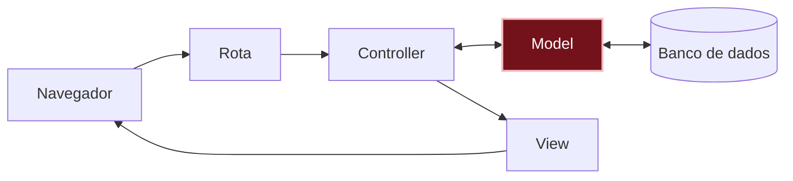

# O que aconteceu?

Por dentro do app

TODO: explicação do conceito, sem jargão desnecessário; o termo técnico aparece aqui (e linka o glossário).

Você está aqui: este é o caminho que uma requisição percorre dentro do app.

Não existem perguntas bobas

TODO: 2–3 perguntas e respostas curtas.

TODO: cada pergunta num bloco `
`.

Quebre de propósito Opcional

TODO (opcional): uma mudança que causa erro de propósito e como ler a mensagem.

Preciso de IA para este capítulo?

{: .ia }
TODO: o código gerado aceita um recado vazio; quem decide que isso é um erro? Comparar o código gerado com a lista de casos do "Pense antes".

Não esqueça

TODO: 3–5 bullets.

Quiz

TODO: 2–3 perguntas.

Ver respostas

TODO

Para saber mais

TODO (opcional): links e vídeos para quem quiser ir além.

## E agora?

Próximo desafio: [Como mostrar o mural de recados para o mundo?]({{ site.baseurl }})
