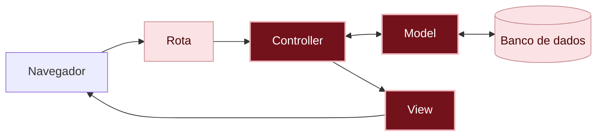

# O que aconteceu?

Por dentro do app

Quando alguém clica em **Postar recado**, o caminho agora tem uma pergunta no meio:

1. O controller monta o recado com o que veio do formulário (`Message.new`).
2. O model confere as regras (`save`). Se estiver tudo certo, guarda o recado no banco de dados e responde `true`. Se faltar alguma coisa, não guarda nada, anota o que faltou em `errors` e responde `false`.
3. O controller decide o que fazer com a resposta: se deu certo, volta para o mural de recados; se não, mostra a página de novo (`render`).
4. A view mostra o formulário com o que a pessoa escreveu e, embaixo de cada campo, o aviso do que falta.

Você está aqui: este é o caminho que uma requisição percorre dentro do app.

Em vermelho escuro, as peças deste capítulo; em rosa claro, as que você já conhece dos capítulos anteriores.

#### As regras ficam no model

O model `Message` deixou de ser só o lugar que guarda e busca recados: agora ele também sabe **o que é um recado válido**. Como todo recado passa pelo model antes de ir para o banco de dados, a regra vale para tudo: o formulário de postar, a correção e até o console.

#### Quem decide é você

O Rails não tinha como saber que um recado vazio é um problema: para ele, um texto vazio é um texto como outro qualquer. Decidir as regras (o que é obrigatório, qual o tamanho máximo, o que acontece quando algo falta) é trabalho de quem programa. Foi por isso que você pensou nelas no plano, antes de escrever código.

#### Redirect ou render

Até aqui, depois de guardar, o controller usava o `redirect_to`: ele manda o navegador fazer uma requisição nova, e a página começa do zero, com o formulário vazio. Agora, quando o recado é recusado, o controller usa o `render`: ele monta a página na mesma hora, com o `@message` que acabou de ser recusado. Por isso o que a pessoa escreveu continua no formulário, junto com os avisos.

Não existem perguntas bobas

Por que a regra fica no model, e não na view?

Porque o formulário é só um dos jeitos de criar um recado. Também dá para criar pelo console, pela correção e, num app maior, por outros caminhos. Com a regra no model, todo recado passa por ela, venha de onde vier.

E os recados vazios que já estavam guardados?

As regras só valem para o que for guardado daqui para frente. Um recado vazio guardado antes continua lá, até alguém apagar. Por isso, no passo 2, você apagou o cartão vazio.

Por que 280 caracteres?

É uma decisão de quem planeja o app: o suficiente para um recado, e pouco o bastante para caber num cartão. Outro app poderia escolher outro número. O importante é a regra existir e estar escrita num lugar só, o model.

O que é o unprocessable_entity? Para ir além

É o nome de um **código de status**, um número que o app manda junto com cada página para dizer como foi a requisição. Esse é o 422, que quer dizer "recebi o formulário, mas não deu para usar o que veio nele". O navegador usa esse código para saber que precisa mostrar a página com os avisos, em vez de seguir em frente.

Por que não aparecem os avisos todos juntos, em cima do formulário? Para ir além

Daria, com o `@message.errors.full_messages`, mas o Rails monta essas frases juntando o nome da coluna, em inglês, com o aviso: ficaria `Author Escreva o seu nome.`. Mostrando cada aviso embaixo do seu campo, a pessoa vê só a frase que você escreveu, e já sabe onde corrigir.

Quebre de propósito Opcional

Na ação `create`, coloque um `#` na frente da linha `@messages = Message.order(created_at: :desc)`, a que fica dentro do `else`. Salve, deixe o formulário vazio e clique em **Postar recado**.

**Dê um palpite:** o que vai acontecer?

Aparece a página de erro **NoMethodError in Messages#create**, com a mensagem `undefined method 'empty?' for nil`. A view do mural de recados pergunta se a lista está vazia (`@messages.empty?`), mas o controller não preparou a lista: para a view, `@messages` é "nada" (`nil`).

Tire o `#` e salve.

Agora, no model, troque `presence: { message: "Escreva o seu nome." }` por só `presence: true`. Salve e poste um recado sem nome.

**Dê um palpite:** o que o aviso vai dizer?

Aparece `can't be blank`, em inglês: é o aviso que o Rails usa quando você não escreve o seu.

Volte para `presence: { message: "Escreva o seu nome." }`, salve e poste de novo: o aviso volta para o português.

Preciso de IA para este capítulo?

Este capítulo é o melhor exemplo do porquê de pensar antes de pedir.

Se você pedir para uma IA "fazer um mural de recados em Rails", o código gerado provavelmente vai funcionar e aceitar recados vazios, como o seu aceitava até agora. Ou então vai ter regras que a IA inventou, que podem não ser as que você queria. **Quem decide que um recado vazio é um erro é você**, e a IA só sabe disso se você disser.

Com o plano, o pedido fica assim:

> No meu app Rails, o model `Message` tem `author` e `content`. Quero estas regras: `author` e `content` obrigatórios, e `content` com no máximo 280 caracteres. Os avisos devem ser em português: "Escreva o seu nome.", "Escreva o seu recado." e "O recado pode ter no máximo 280 caracteres.". Quando o recado for recusado, o formulário volta com o que a pessoa escreveu e com o aviso embaixo de cada campo.

Confira o resultado contra o plano:

- As três regras estão no model?
- Um recado só com espaços é recusado?
- A ação `create` e a ação `update` conferem se deu certo, com `if`?
- O que a pessoa escreveu continua no formulário quando o recado é recusado?

Não esqueça

- As regras dos dados ficam no model, com o `validates`, e valem para todo recado, venha de onde vier.
- O `save` e o `update` respondem `true` se deu certo e `false` se o recado foi recusado.
- Quando dá certo, o controller usa o `redirect_to`; quando o recado é recusado, usa o `render`, que mantém o que a pessoa escreveu.
- O Rails não sabe o que é um recado válido: quem decide é quem programa.

Quiz

1. Alguém tenta postar um recado só com o nome. O recado é guardado no banco de dados?
2. Por que o nome que a pessoa escreveu continua no formulário quando o recado é recusado?
3. Você quer que o nome tenha no máximo 50 caracteres. Em qual arquivo você escreve essa regra?

Ver respostas

1. Não. O model confere as regras antes de guardar, e o `save` responde `false`.
2. Porque o controller usa o `render`, que mostra a página com o `@message` recusado, em vez do `redirect_to`, que começaria do zero.
3. No model, `app/models/message.rb`: `validates :author, length: { maximum: 50, message: "..." }`.

Para saber mais

Guia oficial do Rails, em inglês:

- [Active Record Validations](https://guides.rubyonrails.org/active_record_validations.html): todas as regras que o Rails já traz prontas.

## E agora?

O mural de recados está pronto: bonito, e só aceita recados de verdade. Mas ele só funciona dentro do seu codespace. Próximo desafio, opcional: [Como mostrar o mural de recados para o mundo?]({{ site.baseurl }})

Vai parar por aqui hoje? Desligue o servidor e o codespace, como no passo **Desligue o servidor e o codespace** do [capítulo 08]({{ site.baseurl }}).
