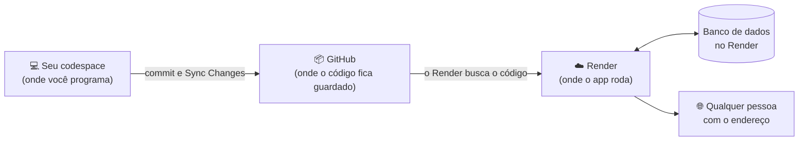

# 08. Como mostrar o mural de recados para o mundo? Opcional

Tempo: uns 40 minutos, contando a espera do primeiro deploy.
{: .fs-5 }

{: .dica }
Este capítulo é **opcional**. O seu mural de recados já está pronto no capítulo 07. Aqui, ele vai para a internet, e para isso você vai precisar de uma conta no Render e de alguns minutos de espera. Se o tempo do workshop acabar, dá para fazer em casa, com calma, seguindo o guia.

## O desafio

O app Mural de recados está pronto: dá para postar, ver, corrigir e apagar, os cartões estão bonitos e recados vazios são recusados. Mas ele só funciona dentro do seu codespace. Quando você desliga o codespace, o app sai do ar, e ninguém mais consegue abrir.

O desafio agora é **colocar o mural de recados no ar**: um endereço na internet que qualquer pessoa pode abrir, do celular ou do computador, e deixar um recado.

## Pense antes de programar

Reserve uns 5 minutos. Não existe resposta errada.

- Hoje, onde o app roda? O que acontece com ele quando você fecha o codespace?
- Para o app ficar no ar o tempo todo, ele precisa rodar em algum computador ligado o tempo todo. De quem seria esse computador?
- Os recados que você postou no seu codespace vão junto para o app no ar? Por quê?
- Quem pode postar no mural de recados no ar? O que pode dar errado quando qualquer pessoa pode abrir o seu app?

## Compare com o nosso plano

Abrir o nosso plano

O app vai rodar no **Render**, um serviço que guarda e roda apps na internet. O caminho do código fica assim:

- **Onde o app roda:** num computador do Render, ligado o tempo todo, com um endereço parecido com `https://mural-de-recados.onrender.com`.
- **De onde vem o código:** do seu repositório no GitHub, o mesmo que recebe os seus commits desde o capítulo 01. Cada vez que você faz um commit e um **Sync Changes**, o Render atualiza o app no ar sozinho.
- **Os recados:** o app no ar tem o seu próprio banco de dados, no Render. Ele começa vazio: os recados de teste do seu codespace ficam só no codespace.
- **O plano gratuito:** o app fica no ar de graça, com dois combinados. Se ninguém abrir o mural de recados por uns 15 minutos, ele "dorme", e a próxima pessoa espera cerca de um minuto para ele acordar. E o banco de dados gratuito dura 30 dias: depois disso, os recados do mural de recados no ar são apagados.
- **A palavra-chave:** para robôs não encherem o mural de recados de propaganda, o app pede uma palavra-chave antes de abrir. Quem é do workshop recebe a palavra-chave e entra.
- **O mínimo:** um endereço que funciona. Um endereço com nome próprio, como `mural.seunome.com`, fica de fora.

## Mão na massa

Agora é com você: siga os passos em [Mão na massa]({{ site.baseurl }}). Quando terminar, siga para [O que aconteceu?]({{ site.baseurl }}).

## O que aconteceu?

Terminou os passos? Em [O que aconteceu?]({{ site.baseurl }}) você entende cada passo, vê se precisa de IA e responde um quiz.
