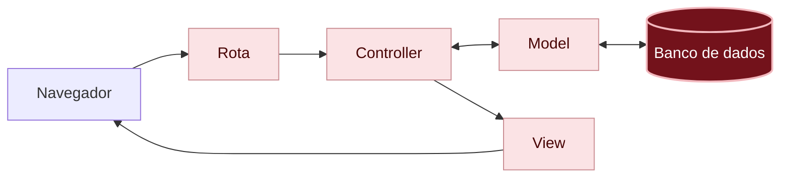

# O que aconteceu?

Por dentro do app

Agora o seu app existe em dois lugares:

| | No seu codespace | No Render |
|---|---|---|
| **Para quê** | Programar e testar | Qualquer pessoa usar |
| **Quem abre** | Só você | Quem tiver o endereço e a palavra-chave |
| **Banco de dados** | SQLite, um arquivo (`storage/development.sqlite3`) | PostgreSQL, um serviço separado |
| **Os recados** | Os seus testes | Os recados de verdade |

Quem programa chama o primeiro de ambiente de **desenvolvimento** (*development*) e o segundo de ambiente de **produção** (*production*). O código é o mesmo, e o Rails ajusta o que muda entre os dois, como o banco de dados.

Você está aqui: este é o caminho que uma requisição percorre dentro do app. Ele é o mesmo no codespace e no Render: o que mudou foi o computador onde o app roda.

Em vermelho escuro, a peça que mudou neste capítulo; em rosa claro, as que você já conhece dos capítulos anteriores.

#### O deploy

**Deploy** (implantação) é o nome do processo de levar o código para o lugar onde o app roda e ligar o app de novo. Cada deploy do Render segue a mesma receita: buscar o código no GitHub, rodar o `bin/render-build.sh` e ligar o app com o `bin/rails server`. Como ele acompanha o seu repositório, cada **Sync Changes** vira um deploy novo.

#### Segredos ficam fora do código

O `DATABASE_URL` (com a senha do banco de dados), o `RAILS_MASTER_KEY` (a chave secreta do app) e a `ACCESS_PASSWORD` (a palavra-chave do mural de recados) não estão no seu código nem no GitHub: eles foram colados direto no Render, como **variáveis de ambiente**. Assim, mesmo que alguém veja o seu repositório, não consegue entrar no seu banco de dados.

#### Seus commits contam a história

Desde o capítulo 01, você guardou o progresso com commits e enviou para o GitHub. Foi isso que permitiu o Render buscar o app pronto. O histórico de commits é também a história do seu mural de recados, capítulo por capítulo.

Não existem perguntas bobas

Por que o app no ar começou sem os meus recados?

Porque cada lugar tem o seu banco de dados. O banco de dados do codespace é um arquivo que não vai para o GitHub, e o Render só recebe o que está no GitHub. Os recados de teste ficam no codespace, e o mural de recados no ar começa do zero, pronto para os recados de verdade.

O meu mural de recados vai ficar no ar para sempre?

No plano gratuito do Render, o banco de dados dura 30 dias: depois disso, ele é apagado, e o mural de recados no ar perde os recados. O app continua no ar, mas sem banco de dados ele para de funcionar. Para manter por mais tempo, dá para pagar um plano do Render ou usar outro serviço. O código continua seguro no seu GitHub.

Qualquer pessoa pode apagar os recados do meu mural?

Qualquer pessoa que tenha a palavra-chave, sim. A palavra-chave segura os robôs e quem achar o link por acaso, mas todo mundo usa a mesma, então o app não sabe quem é quem. Foi a decisão que a gente tomou lá no [planejamento]({{ site.baseurl }}): para um mural de recados do workshop, aceitar esse risco é razoável. Num app de verdade, aberto para qualquer pessoa, valeria ter contas e regras de quem pode fazer o quê. Isso fica para um próximo projeto.

Por que o Render, e não outro serviço? Para ir além

O Render tem um plano gratuito que funciona com apps Rails sem precisar configurar um servidor. Existem muitos outros serviços para colocar apps no ar, cada um com as suas vantagens, e o próprio Rails traz uma ferramenta para isso, o Kamal. O que você aprendeu aqui vale para quase todos: o código vem do GitHub, os segredos ficam em variáveis de ambiente, e o banco de dados de produção é separado do de desenvolvimento.

Preciso de IA para este capítulo?

Não. Os passos são cliques no Render e duas mudanças pequenas no código.

Onde uma IA pode ajudar: entender uma mensagem de erro do deploy. Copie as últimas linhas das mensagens e peça uma explicação, como em [Usando IA como tutora]({{ site.baseurl }}).

{: .atencao }
Nunca cole numa IA, nem em nenhum outro lugar, o `DATABASE_URL` nem o conteúdo do `config/master.key`. Antes de colar uma mensagem de erro, confira se ela não tem nenhum desses dois.

Não esqueça

- O mesmo app roda em dois lugares: no codespace, para programar (desenvolvimento), e no Render, para as pessoas usarem (produção).
- Cada lugar tem o seu banco de dados.
- Deploy é levar o código para onde o app roda. No Render, cada **Sync Changes** vira um deploy.
- Segredos, como senhas e chaves, ficam em variáveis de ambiente, e não no código.

Quiz

1. Você mudou a cor do botão no codespace, mas o mural de recados no ar continua igual. O que faltou?
2. Por que o app no Render usa PostgreSQL, e não o arquivo do SQLite?
3. Onde fica o `RAILS_MASTER_KEY` do app no ar: no código, no GitHub ou no Render?

Ver respostas

1. Fazer um commit e clicar em **Sync Changes**: o Render só atualiza com o que chega no GitHub.
2. Porque, no Render, os arquivos que o app cria são apagados quando ele reinicia. O PostgreSQL roda separado e não perde os recados.
3. No Render, como variável de ambiente.

Para saber mais

Em inglês:

- [Deploying Rails on Render](https://render.com/docs/deploy-rails-8): o guia do Render para apps Rails.
- [Free instances](https://render.com/docs/free): o que o plano gratuito do Render oferece e os seus limites.

## E agora?

Você construiu um app do zero e colocou no ar. 🎉 Para fechar o dia: [Terminei! E agora?]({{ site.baseurl }})
